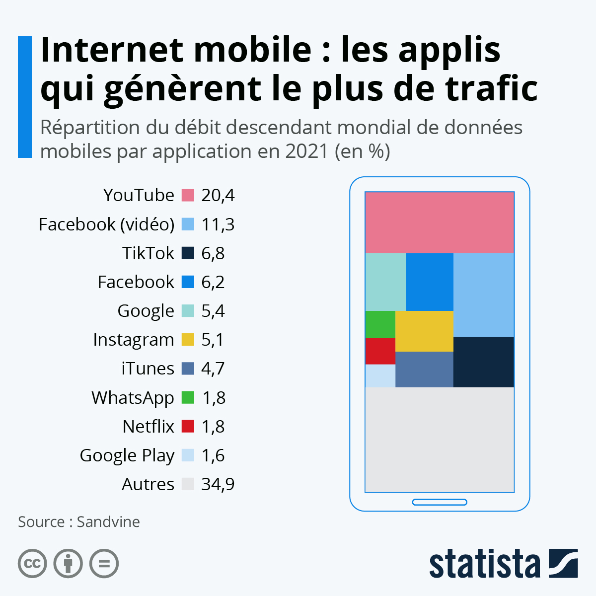
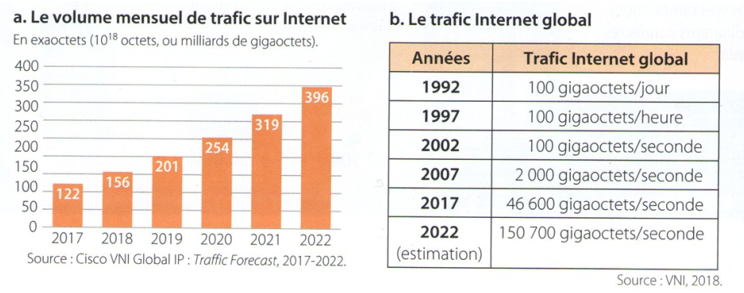

# CHAPITRE 3: INTERNET

Dès les années cinquante, les ordinateurs ont été mis en réseau pour échanger des informations, mais de façon très liée aux constructeurs d’ordinateurs ou aux opérateurs téléphoniques.

Les réseaux généraux indépendants des constructeurs sont nés aux États-Unis avec ARPANET (1969) et en France avec Cyclades (1972).

Cet effort a culminé avec internet, né en 1983.

## Internet : réseaux physiques et données

Internet est un réseau mondial de réseaux informatiques qui repose sur une grande variété d’infrastructures physiques (câbles, antennes et relais, satellites, fibres,…) par lesquelles transitent les données.

### Les câbles sous-marins d'internet

[**lien pour regarder la vidéo**](https://www.youtube.com/watch?v=MzcKHQyDL5o){:target="_blank"} 

D’un seul câble transatlantique en 1858 et d’une vingtaine en 2015, on passe à plus de 450 câbles sous-marins aujourd’hui qui s’étendent sur presque 1,3 millions de kilomètres au fond des océans. Ces liaisons à fibres optiques supportent plus de 99% du trafic internet mondial. Leur nombre augmente chaque année pour faire face à l’augmentation du flux de données.

Visualiser les câbles sous-marins : [**https://www.submarinecablemap.com**](https://www.submarinecablemap.com/){:target="_blank"}

### Le débit de la connexion internet

#### Multiples de l'octet

| Nom |	Symbole | Valeur |
| -- | -- | -- | -- |
| kilooctet 	| ko |	103 |
| mégaoctet |	Mo 	| 106 |
| gigaoctet |	Go 	| 109 |
| téraoctet |	To 	| 1012 |
| pétaoctet |	Po 	| 1015 |
| exaoctet |	Eo 	| 1018 |
| zettaoctet | Zo 	| 1021 |
| yottaoctet |	Yo 	| 1024 |
| ronnaoctet |	Ro 	| 1027 |
| quettaoctet |	Qo | 1030 |

Un bit est une information élémentaire 0, ou 1. Un octet est constitué de 8 bits. Le débit d'une transmission de données est la vitesse à laquelle ces données sont transmises sur le réseau. Il est exprimé en bits par seconde noté b/s (ou kilobits par seconde (kb/s), mégabits par seconde (Mb/s), gigabits par seconde (Gb/s)…). Il se calcule avec la formule : 

débit = taille (en bits) / temps (en seconde)

??? abstract "Exercice" 
    *  Un fichier de 2 Mo se télécharge en 17 secondes. Calculer le débit de cette transmission.
    * Quel est le temps de téléchargement d’une vidéo de 700 Mo avec un débit de 32Mb/s ?
    * J'ai mis 3 minutes à télécharger un jeu avec une connexion à 12Mo/s. Quelle est la taille de ce jeu ?

### Le trafic

Application mobile:
{:width=10%}

Types de données:
{:width=10%}

??? abstract "Exercice" 
    * Quel est le type de données majoritairement échangé sur internet ?

Trafic internet: 
{:width=10%}

??? abstract "Exercice" 
    * En considérant qu’un film en haute définition peut être stocké sur 4 Go, évaluer l’équivalent en nombre de films par mois du trafic internet mensuel actuel.

Croissance du volume de données : 
{:width=10%}

??? abstract "Exercice" 
    * Commenter l'évolution de la croissance d'internet

<!--
## PROGRAMMATION

* [TD1 - Introduction au langage HTML](./ressources/Act1-introduction-au-html.pdf){:target="_blank"}    
* [TD2 - Introduction aux feuille de style avec CSS](./ressources/Act2-feuille-de-style-CSS.pdf){:target="_blank"}   
* [TD3 - Découverte des tableaux en HTML](./ressources/Act3-HTML-tableau.pdf){:target="_blank"}   

Pour réaliser les activités de ce chapitre, veuillez utiliser ce [**lien**](https://codebetter.lucaswillems.com/){:target="_blank"}  

??? abstract "Correction"   

    {:width=3%}[PoemeMusset.html (Partie1)](./ressources/poemeMusset.html){:target="_blank"}   
    {:width=3%}[Image Alfred de Musset](./ressources/ADM.png){:target="_blank"}   
    {:width=3%}[style.css](./ressources/style.css){:target="_blank"}   
    <!--[Tableaux](./ressources/tableaux/Act3.zip){:target="_blank"} -->  
<!-- 
??? danger "EVALUATION"

    Vous devez programmer un site WEB en utilisant les connaissance acquise lors des 3 TDs effectués en classe sur le HTML et CSS.    
    Votre site portera sur le thème de votre choix (Mangas, livres, Films, Musique...etc).
    A la date indiqué, vous devrez présenter votre production à l'oral suivant les critères suivants:
    
    * Durée de la présentation : 5 minutes
        * Présentation: 30 secondes
        * Le thème : 30 secondes 
        * Le code + le site : 3 minutes
        * Conclusion (difficultés rencontrées, remarques...etc ) : 1 minute

## DECOUVERTE

### Activité 1 - Le WEB vs Internet

* Télécharger le document {:width=3%}[**Le_WEB.pdf**](./ressources/Le_WEB.pdf){:target="_blank"}.
* Sur le document, plusieurs liens menant vers des vidéos, seront à visionner pour pouvoir répondre aux différentes questions du même document.

### Activité 2 - Les cookies

* Télécharger le document {:width=3%}[**Les_cookies.pdf**](./ressources/Les_cookies.pdf){:target="_blank"}.
* Vous devez répondre aux questions du document en visionnant la vidéo suivante (cliquer sur la vidéo pour la visionner):

[{:width=30%}](./ressources/j_ai_attrape_un_cookie.mp4 "j'ai attrapé un cookie"){:target="_blank"}

## SYNTHESE

Voici la synthèse:
{:width=3%}[**Synthèse_La-page-WEB.pdf**](./ressources/Synthèse_La-page-WEB.pdf){:target="_blank"}

-->
