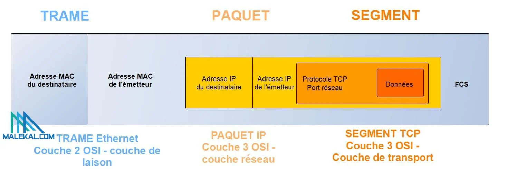

# THEMATIQUE : INTERNET

**Objectifs pédagogiques :**

1. Comprendre ce qu'est Internet et son fonctionnement général.
2. Découvrir les principaux protocoles utilisés (HTTP, DNS, IP, etc.).
3. Comprendre la notion de réseau (LAN, WAN, etc.) et les étapes pour accéder à un site web.
4. Être sensibilisé à la sécurité et à la vie privée sur Internet.

??? abstract "Introduction sur les réseaux physiques" 

    ## Ce qu'en dit le programme: 

    Dès les années cinquante, les ordinateurs ont été mis en réseau pour échanger des informations, mais de façon très liée aux constructeurs d’ordinateurs ou aux opérateurs téléphoniques.

    Les réseaux généraux indépendants des constructeurs sont nés aux États-Unis avec ARPANET (1969) et en France avec Cyclades (1972).

    Cet effort a culminé avec internet, né en 1983.

    ## Internet : réseaux physiques et données

    Internet est un réseau mondial de réseaux informatiques qui repose sur une grande variété d’infrastructures physiques (câbles, antennes et relais, satellites, fibres,…) par lesquelles transitent les données.

    ### Les câbles sous-marins d'internet

    <iframe width="100%" height="315" src="https://www.youtube.com/embed/MzcKHQyDL5o?si=QCwOnbsyeS68GufL" title="YouTube video player" frameborder="0" allow="accelerometer; autoplay; clipboard-write; encrypted-media; gyroscope; picture-in-picture; web-share" referrerpolicy="strict-origin-when-cross-origin" allowfullscreen></iframe>

    D’un seul câble transatlantique en 1858 et d’une vingtaine en 2015, on passe à plus de 450 câbles sous-marins aujourd’hui qui s’étendent sur presque 1,3 millions de kilomètres au fond des océans. Ces liaisons à fibres optiques supportent plus de 99% du trafic internet mondial. Leur nombre augmente chaque année pour faire face à l’augmentation du flux de données.

    Visualiser les câbles sous-marins : [**https://www.submarinecablemap.com**](https://www.submarinecablemap.com/){:target="_blank"}

    ### Le débit de la connexion internet
    
    #### Multiples de l'octet

    | Nom |	Symbole | Valeur |
    | -- | -- | -- |
    | kilooctet | ko | $10^{3}$ |
    | mégaoctet | Mo | $10^{6}$ |
    | gigaoctet | Go | $10^{9}$ |
    | téraoctet | To | $10^{12}$ |
    | pétaoctet | Po | $10^{15}$ |
    | exaoctet | Eo | $10^{18}$ |
    | zettaoctet | Zo | $10^{21}$ |
    | yottaoctet | Yo | $10^{24}$ |
    | ronnaoctet | Ro | $10^{27}$ |
    | quettaoctet | Qo | $10^{30}$ |

    #### Unités de grandeur en informatique

    * Un bit est une information élémentaire qui peut prendre 2 valeurs possible: 0 ou 1.    
    * Un octet est constitué de 8 bits. (1 Byte = 1 octet = 8 bits)     
    * Le débit d'une transmission de données est la vitesse à laquelle ces données sont transmises sur le réseau. Il est exprimé en bits par seconde noté bits/s ou b/s (ou kilobits par seconde (kb/s), mégabits par seconde (Mb/s), gigabits par seconde (Gb/s)…).    

    !!! example "Formule du débit" 
        
 $débit = \frac{taille (en bits)}{temps (en secondes)}$ 

    !!! question "Exercice 1" 
        a) Un fichier de 2 Mo se télécharge en 17 secondes. **Calculer** le débit de cette transmission.  
        b) Pour une vidéo de 700 Mo et un débit de 32Mb/s. **Calculer** le temps de téléchargement.  
        c) Le téléchargement d'un jeu à pris 3 minutes avec une connexion de 12Mo/s. **Calculer** la taille de ce jeu ?

    ### Le trafic

    #### Doc 1. Application mobile:
    
    {:width=100%}

    #### Doc 2. Types de données:
    
    {:width=100%}

    !!! question "Exercice 2" 
        * A partir du Doc 1 et 2, **identifier** le type de données majoritairement échangé sur internet ?

    #### Doc 3. Trafic internet: 
    
    {:width=100%}

    !!! question "Exercice 3" 
        * En considérant qu’un film en haute définition peut être stocké sur 4 Go, **évaluer** l’équivalent en nombre de films par mois du trafic internet mensuel actuel.

    #### Doc 4. Croissance du volume de données : 

    {:width=100%}

    !!! question "Exercice 4" 
        * **Commenter** l'évolution de la croissance d'internet

<!--

??? abstract "Le protocole TCP/IP ?" 

    ## Ce qu'en dit le programme:

    Internet est défini par le protocole IP (Internet Protocol), ensemble de normes qui permettent d’identifier et de nommer de façon uniforme tous les ordinateurs ou objets qui lui sont connectés. 
    
    IP est accompagné de protocoles de transmission pour transférer l’information par paquets, le principal étant TCP/IP (Transmission Control Protocol). 
    
    De nature logicielle, internet s’appuie sur une grande variété de réseaux physiques où IP est implémenté. Il uniformise l’accès à tous les ordinateurs, les téléphones et les objets connectés.

    <iframe width="100%" height="315" src="https://www.youtube.com/embed/aX3z3JoVEdE?si=jgwzKquTVDe1B357" title="YouTube video player" frameborder="0" allow="accelerometer; autoplay; clipboard-write; encrypted-media; gyroscope; picture-in-picture; web-share" referrerpolicy="strict-origin-when-cross-origin" allowfullscreen></iframe>

    Après avoir regardé la vidéo, **tester** ses connaissances en répondant au QCM et **faire** une capture d'écran de votre score:    
    [Lien vers le test](https://numeres.net/9782206103389/res/9782206103389-ht5-snt-03/index.html)

    ## Définition:

    * **TCP (Transmission Control Protocol)**: c'est le protocole qui assure la transmission de données entre une source et une destination.   
    * **IP (Internet Protocol)** : c’est un protocole sans connexion. Ce qui signifie que chaque unité de données est adressée et acheminée individuellement du périphérique source au périphérique cible, et la cible n’envoie pas d’accusé de réception à la source.

    TCP/IP est donc un protocole qui permet la communication entre les équipements au sein d’un réseau. Il est au coeur de l'architecture d'internet et est utilisé par tous les services internet pour communiquer : _les sites WEB, les jeux en line, le streaming, etc_.

    ## Modèle OSI Vs Modèle TCP/IP
    
    TCP/IP fonctionne par couche ainsi on parle aussi de couches TCP/IP.
    On peut parfois aussi parler de piles TCP/IP.    
    Le protocole TCP/IP reprend en grande partie le **modèle OSI (Open Systems Interconnection)** qui est un modèle théorique.

    {:width=100%}

    Le modèle OSI propose 7 couches mais l’architecture TCP/IP est une version simplifiée.

    ## L'encapsulation
    L'encapsulation, en informatique, est un procédé consistant à inclure les données d'un protocole dans un autre protocole.

    La trame suivante vous montre comment sont encapsulées les différentes couches:

    

    ## Le protocole TCP
    
    Quand un ordinateur "emeteur" doit envoyer des données à un ordinateur "récepteur", l'emeteur utilise le protocole TCP pour mettre en forme les données à envoyer.

    Pour vérifier que les paquets sont bien arrivés le protocole TCP utilise une poignée de main à trois temps :
    {:width=70%}

    ## Les types de réseaux

    * LAN (Local Area Network ou Réseau Local) : réseau local permettant de relier des ordinateurs et des périphériques situés à proximité les uns des autres.

    * MAN (Metropolitan Area Network ou Réseau Métropolitain) : série de réseaux locaux permettant de relier plusieurs LAN géographiquement à proximité.

    * WAN (Wide Area Network ou Réseau Etendu) : réseau étendu couvrant des vastes zones géographiques à l'échelle d'un pays ou d'un continent par exemple.

-->