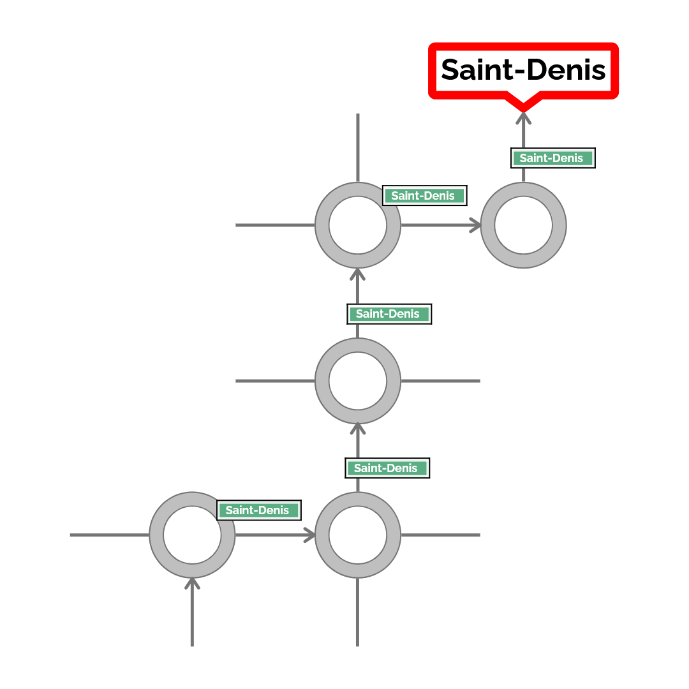

# Activité écrite : Comprendre le routage en réseau

## Objectifs de la séance :

* Comprendre comment un message circule sur Internet.
* Découvrir le rôle des adresses IP, des routeurs et des tables de routage.
* Introduire la notion de sauts entre les équipements du réseau.

## Analogie du réseau avec la route.

Lorsque nous prenons la route, nous nous dirigeons grâce au panneau.
Pour comprendre comment fonctionne un réseau informatique, nous pouvons faire un paralèlle avec le fonctionnement des ronds-points.
Lorsque nous arrivons sur un rond point, celui-ci nous indique (par un panneau) la sortie à prendre en fonction du lieu où nous souhaitons nous rendre.
Mais parfois la sortie indiquée nous oriente vers le prochain rond point qui nous indiquera (a son tour) par des panneaux la sortie qui nous intéresse.

{width=70%}

Donc parfois le rond point est celui qui nous menera vers notre destination, parfois il est une étape sur notre trajet qui nous dirigera vers un autre rond point qui est la dernière étape de notre trajet.

**Le réseau fonctionne de la même manière** où :

* les ronds points sont des routeurs, 
* la route représente les câbles, les switchs ...etc.
* les ordinateurs, serveurs et autres périphériques représentent les lieux où nous souhaitons nous rendre.

## Comprendre un schéma réseau

{ width=100%}

!!! question "Exercice 1 : Observez le schéma ci-dessus et répondez aux questions."

    * **Nommer** l'emmeteur et le récepteur du message ?
    * **Lister** les périphériques du schéma ?
    * **Donner** l'"itinéraire" du message ?

!!! question "Exercice 2"

    **Compléter** le texte à trous suivant:

    **✍️ Mots à placer :** _paquets – destinataire – routeurs_

    Lorsque nous envoyons un message sur Internet, il est découpé en ________________________________________________________________________________________. 

    Chaque paquet contient l'adresse IP de l'expéditeur et du ________________________________________________________________________________________. 

    Pour atteindre sa destination, le paquet traverse plusieurs ________________________________________________________________________________________ qui utilisent une table de routage pour choisir le meilleur chemin.

## Cas pratique :

Voici l'adressage de notre réseau:

| Désignation | Adresse IP | Adresse IP 2 |
| -- | -- | -- |
| Server0 | 192.168.1.1 | - |
| PC0 | 192.168.1.10 | - |
| PC1 | 192.168.1.20 | - |
| PC3 | 192.168.3.10 | - |
| PC4 | 192.168.3.11 | - |
| Printer0 | 192.168.3.20 | - |
| Router0 | 192.168.1.254 | 192.168.2.254 |
| Router1 | 192.168.2.253 | 192.168.3.254 |

Un message doit être envoyé de 192.168.1.10 (Client - PC0) vers 192.168.3.20 (Printer0). 

Voici les routes possibles :

| Routeur | Destination | Prochain saut |
| -- | -- | -- | 
| Router0 | 192.168.1.0 | Router0 | 
| Router0 | 192.168.2.0 | Router0 | 
| Router0 | 192.168.3.0 | Router1 | 
| Router1 | 192.168.1.0 | Router0 | 
| Router1 | 192.168.2.0 | Router1 | 
| Router1 | 192.168.3.0 | Router1 | 

!!! question "Exercice 3"

    * En suivant la table de routage, quel chemin suivra le message ?
    * Que se passe-t-il si Router1 tombe en panne ?

