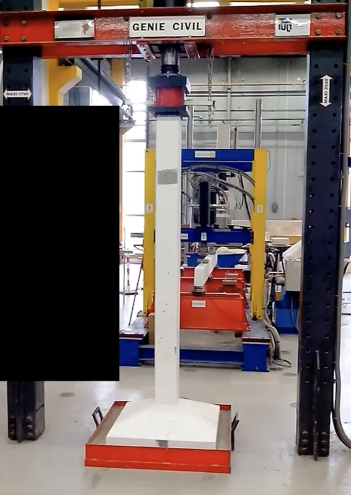
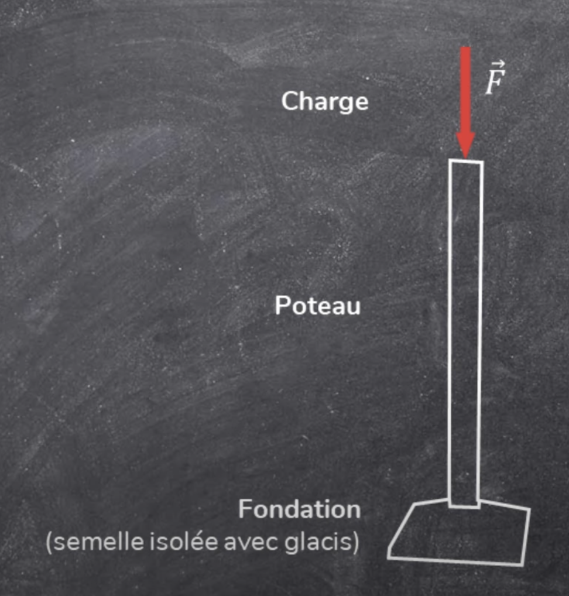
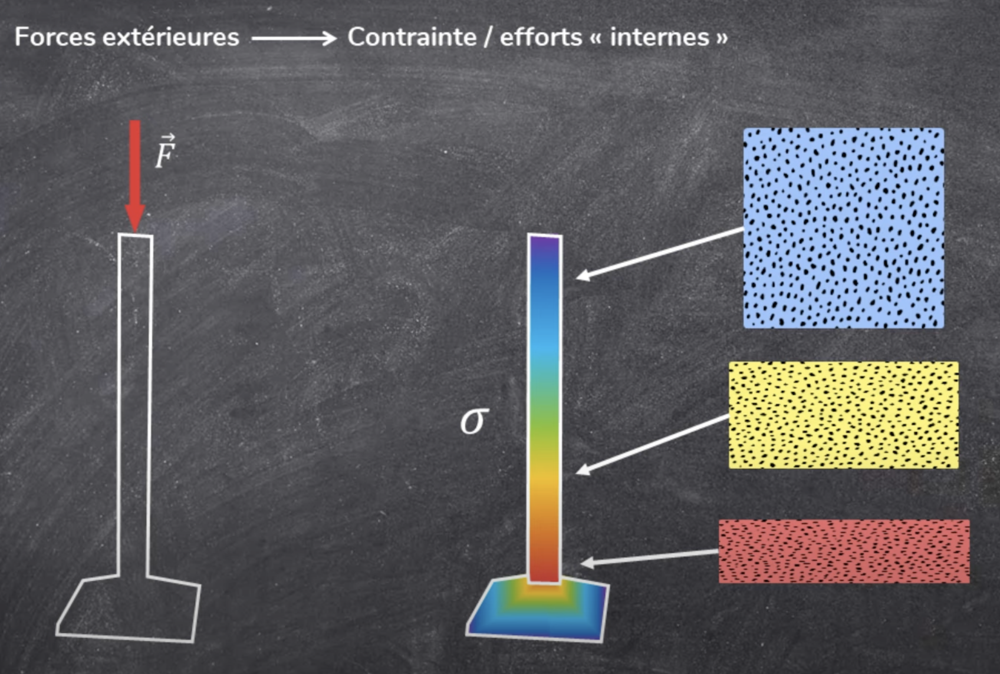

Sources [^nbp]
[^nbp]: [Chaîne YouTube de Mathieu BONTE](https://www.youtube.com/@mathieubonte)
# RÉSISTANCE DES POTEAUX À LA COMPRESSION

??? info "_CE QUE VOUS ALLEZ VOIR DANS CE COURS_"
    * _Comportement d'un poteau en compression._  
    * _Notion et calcul de contrainte._  
    * _Contrainte admissible en fonction des différents matériaux._  
    * _Vérification de la résistance d'un poteau._  

    | Formule importante |
    | :-: |
    | $ \sigma = \frac{F}{S}$ |  

## __COMPORTEMENT D'UN POTEAU EN COMPRESSION__

__Cliquer sur l'image pour voir la vidéo !!__  
[{ width=200px }](./videos/Rupture%20en%20compression%20dun%20poteau%20en%20béton%20armé_1080p.mp4 "Rupture d'un poteau")  

Ce que vous venez de voir est la rupture d'un poteau en béton armé soumis à de la compression.  

!!! info "DÉFINITION: __La compression__" 
    La compression est une sollicitation qui provoque le raccourcissement d'un élément de structure.  
    On dit qu'un élément travaille en compression. C'est le cas des poteaux dans une structure.

C'est ce que nous avons vu dans la vidéo et nous pouvons le schématisé de la manière suivante:  

{ width=400px }  
Une charge F est appliquée en tête de poteau, reposant sur une fondation.  
Mais __pourquoi le poteau a -t- rompu à sa base ?__  

L'explication est relativement simple:  
{ width=400px }  

La tête du poteau reprend la force transmise par la presse, soit 535 kilonewtons ou environ 54 tonnes.   

* Une section située 50 cm en dessous reprendra __environ 30 kg de plus__. La charge de la presse + le poids de 50 cm de poteau.
* Une section située à 1 mètre reprendra __60 kg de plus__.
* La section en pied de poteau reprendra le poids de l'ensemble du poteau + la charge de la presse soit: __54 tonnes + 120 kg__.

C'est bien le __pied de poteau__ qui reprend le plus de poids.  

## __NOTION ET CALCUL DE CONTRAINTE__

Pour quantifier les efforts à l'intérieur de la matière, on utilise le concept de contrainte noté "$\sigma$".  

La force appliquée en tête de poteau, c'est-à-dire en un point, occasionne des modifications dans la matière de tout le solide.  
Ces modifications internes sont quantifiées par ce que l'on nomme la __contrainte__. Cette contrainte a pour effet de déformer la structure et potentiellement amener la rupture.  
{ width=400px }  

Pour comprendre la __contrainte__, il faut imaginer un élément de matière, par exemple du béton, soumis à la compression.
{ width=600px }  

* Lorsque cet élément est comprimé, la structure du matériau l'est aussi.
* Plus la force est importante, plus la contrainte à l'intérieur de la matière augmente.
* Si vous poursuivez l'expérience, il arrivera un moment où le matériau ne sera plus assez résistant et arrivera à la rupture.

Alors que la force est constante, la répartition de la __contrainte__ dans un solide soumis à cette force ne l'est pas. Certaines parties sont plus comprimées que d'autres. Dans le cas présent, le __pied du poteau est la partie la plus contrainte__.  
{ width=400px }  

La contrainte dans le matériau est notée __Sigma ("$\sigma$")__ et a pour unité le __Méga Pascal (MPa)__.  
_Dans le bâtiment, le Pascal n'est pas utilisé, car les forces en jeu sont trop importantes_.  

__La contrainte se calcule grâce à la relation: $\sigma = \frac{F}{S}$__  
avec:

* $\sigma$: la __contrainte__ en Méga Pascal (MPa)
* F: la __force__ (ou __charge__) en Newton (N)
* S: la __section__ en milimètre carré ($mm^2$)

S représente l'__air de la section__. La __section__ est la _forme géométrique_ obtenue lorsque l'on coupe un élément de la structure __perpendiculairement__. Ici, la __section__ du poteau est un carré de 15 cm par 15 cm.
{ width=400px }   

En reprenant la formule et en remplaçant les valeurs de l'essai de compression, on obtient:

$\sigma = \frac{535 \times 10^3}{150 \times 150}$  
!!! warning "Attention"
    Au __numérateur__, nous avons fait attention de convertir la valeur en ___Newton___.  
    Au __dénominateur__, l'air de la section a été calculé en ___milimètre-carré___.

Au final, on obtient, à la rupture:  
$\sigma = 24 MPa$  

On observe que le béton utilisé est un béton c25/30. C'est-à-dire qu'il a une résistance à la compression de 25 MPa. L'essai donne une rupture à 24 MPa, ce qui est très proche de la valeur annoncée.  
{ width=400px }   

## __VÉRIFICATION DE LA RÉSISTANCE D'UN POTEAU__

Maintenant, imaginons que nous souhaitons vérifier à quelle charge peut résister un poteau en béton armé de 10 cm par 10 cm. Nous pourrions réaliser une nouvelle expérience sur le banc d'essai, toutefois cela serait coûteux. __À la place, on peut procéder à un calcul assez simple__.  
{ width=400px }  

On cherche donc F (la charge), on a la résistance du matériau (ici 25 MPa) et les dimensions de la section.  
Il suffit donc de prendre la formule:  
$\sigma = \frac{F}{S}$  
Puis d'isoler F:  
$F = \sigma \times S$  

On remplace par les données du problème, ce qui donne:  
$F = 25 \times 100 \times 100$  
$F = 250000$ Newtons (soit 250 kN ou encore 25 tonnes).   

Nous pouvons conclure, __le poteau de 10 cm par 10 cm en béton armé résistera au maximum à 25 tonnes de compression__.

## __CONTRAINTE ADMISSIBLE PAR MATÉRIAU__

Nous avons vu un exemple pour du béton armé. Maintenant, nous allons voir comment faire pour d'autres matériaux.  

* Comme nous l'avons vu, la résistance en compression du béton est donnée directement dans sa désignation. Un béton c25/30 aura donc une résista,ce de 25 MPa.
* Pour l'acier, on procède de manière similaire à la différence qu'il ne s'agit plus de la résistance en compression, mais de la limite d'élasticité.

!!! info "INFORMATION: "
    L'acier est un matériau dit __ductile__, contrairement au béton qui est __fragile__.   

    Cela signifie qu'il peut se déformer de manière importante avant de rompre.  

    _La limite élastique est la contrainte maximale jusqu'à laquelle le matériau ne sera pas déformé de manière permanente, on dit qu'il reste dans le domaine élastique._  

    __Passé cette limite élastique, le matériau rentre dans le domaine plastique, il ne pourra plus retrouver sa forme d'origine.__   

    En mécanique des structures, on souhaite rester dans le domaine élastique et c'est pourquoi on prend comme contrainte maximale la limite élastique.  
    Elle est donnée par la nuance de l'acier ici S235, la contrainte maximale à prendre en compte sera donc de 235 MPa.  

* Pour le bois, le nombre donné dans la dénomination fait référence non pas à la résistance en compression mais la résistance en flexion.

On utilise donc des tableaux pour retrouver la résistance en compression. Pour un bois C16, la résistance en compression est de 17 MPa.   

Pour les autres types de bois, on procède de manière similaire pour trouver la résistance en compression.   

{ width=800px }  

### Exercice:
Réalisons un dernier problème:  
{ width=800px }  

On cherche:

* la contrainte $\sigma$ (en MPa)
* la contrainte maximale $\sigma_(max)$

On connait:

* la charge: F = 36 kN
* les dimensions de la section: 200x200 cm

??? note "DÉMONSTRATION"
    $\sigma = \frac{F}{S}$  

    $\sigma = \frac{36 \times 10^3}{200 \times 200}$   

    $\sigma = 0,9$ MPa  

    { width=800px }  

    __Conclusion:__ La contrainte dans le poteau (0,9 MPa) est inférieure à la contrainte admissible en compression du bois C18 (18 MPa).   
    La résistance en compression du poteau est vérifiée.   

    !!! warning "ATTENTION"
        Le fait que la contrainte  maximale soit égale au type de bois est une __COINCÏDENCE__. 
        Exemple: Si nous regardons sur les autres types de bois, nous pouvons voir que les contraintes sont différentes du numéro inscrit dans le type du bois.   

