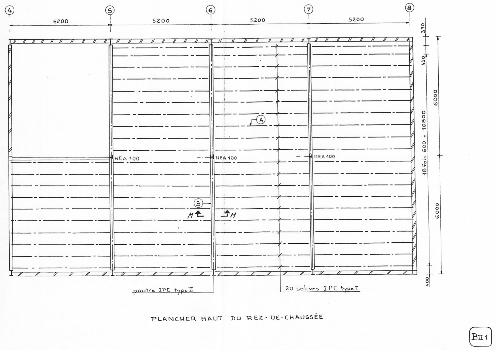
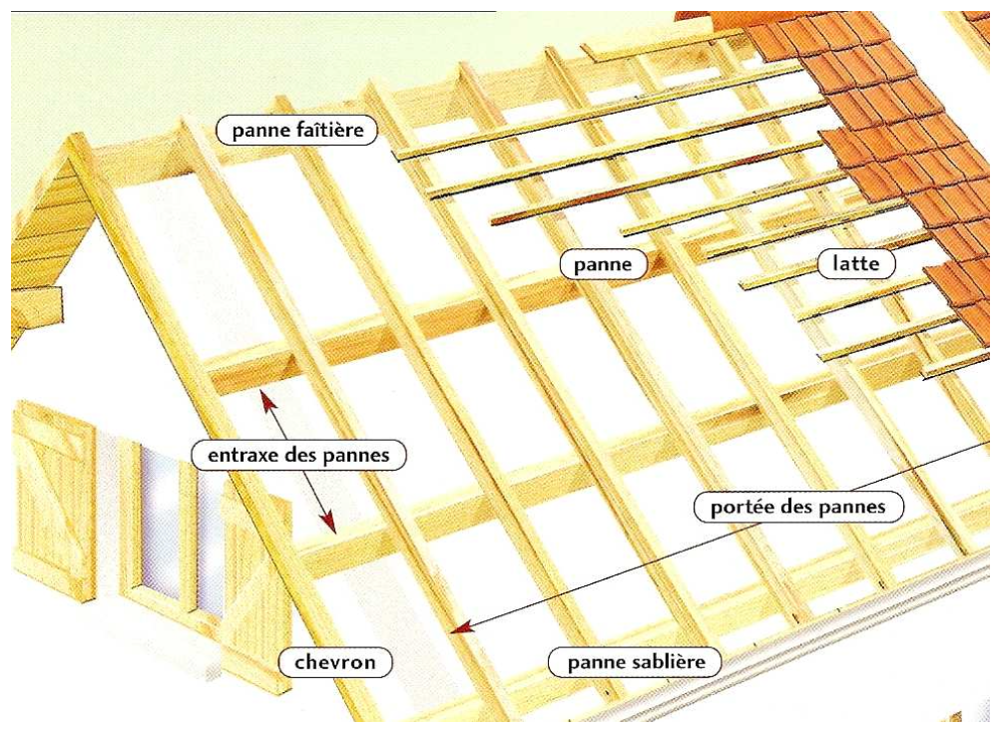
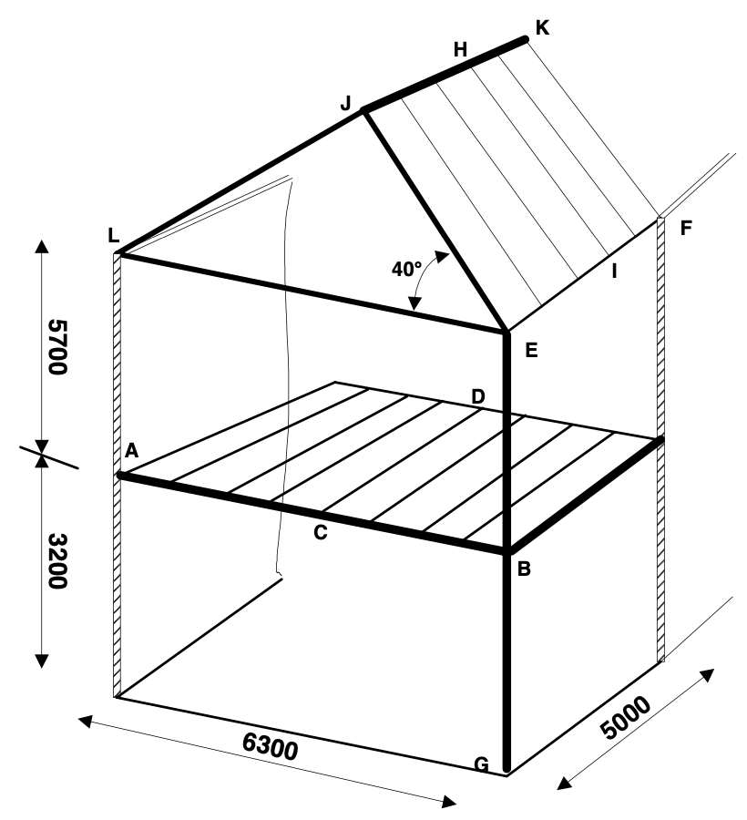

# EXERCICES DESCENTE DE CHARGES

## **EXERCICE 1:**   
^^ÉTUDE DU PLANCHER HAUT DU REZ-DE-CHAUSSÉE^^

Le plancher haut du rez-de-chaussée couvre le logement du gardien et la salle de réunion.   
Ce plancher permet d'augmenter la surface de stockage, l'accès se faisant par l'atelier jardin.   
Il se compose (doc. BII1): 

* d'une ossature métallique réalisée à l'aide   
    1. d'IPE de type II : poutres principales   
    2. d'IPE de type I : poutres secondaires (solives).   
* d'un plafond rapporté sur la face inférieure du plancher.
* d'un revêtement de sol en panneaux de particules posé sur les poutres

Le poids propre de l'ensemble est évalué à **0,8 kN/m$^{2}$**     
Les charges d'exploitation sont égales à **1,5 kN/m$^{2}$**    

Les charges seront affectées des coefficients de pondération suivants $\frac{4}{3}$ pour les charges permanentes $\frac{3}{2}$ pour les charges d'exploitation.    

La charge à prendre en compte dans les calculs, sera donc égale à:     

| Formules | Détails |
| -- | -- |
| $P = (G \times \frac{4}{3}) + (Q \times \frac{3}{2})$ | **G** charges permanentes   **Q** charges d'exploitation |

### ETUDE DE LA SOLIVE (A) : TYPE I 

La solive est simplement appuyée à ses extrémités et a pour portée L = 5,185 m.
**Déterminer** la charge P reprise par la solive A.

{:width=100%}

??? abstract "CORRECTION"

    ^^**Méthode par déduction mathématique:**^^    
    $P = (G \times \frac{4}{3}) + (Q \times \frac{3}{2})$      
    $P = (0.8 \times \frac{4}{3}) + (1.5 \times \frac{3}{2})$     
    $P = 3.32 kN/m^{2}$    

    Surface concerné = $(5.2 \times 12)$    
    Surface concerné = 62.4 m2    

    P$_{surface concerné} = $3.32 \times 62.4$    
    P$_{surface concerné}$ = 207.168 kN/m$^{2}$    

    On divise par le nombre de solive:    
    P$_{solive}= \frac{207.168}{20}$    
    P$_{solive}$ = 10.3584 kN    

    P$_{solive} = \frac{10.3584}{5.185}$    
    P$_{solive}$ = 1.99 kN/m$^{2}$    

    ^^**Méthode experte:**^^    
    On souhaite connaitre la charge sur 1 mètre linéaire de la solive A.    
    On détermine la surface répartie sur la solive A:   
    $\frac{Longeur de la surface concerné}{Nombre de solives} = \frac{12}{20} = 0.6 m^{2}$   

    Nous cherchons maintenant la surface sur 1 mètre linéaire:
    $0.6 \times 1 = 0.6 m^{2}$

    Nous appliquons maintenant la charge P à cette surface:
    $P_{solive} = 0.6 \times 3.32 = 1.99 kN/m^{2}$ 

    

---
## **EXERCICE 2:** 

{:width=100%}

| Numéro | Désignations |
| -- | -- |
| 1 | Solive 100 x 200 C24 |
| 2 | Panneaux particules ep 19 mm, poids volumique 700 daN/m$^{3}$ |
| 3 | Moquette 3 mm, poids surfacique 2 daN/m$^{2}$ |
| 4 | Isolant phonique ep 5mm, poids volumique 1 kN/m$^{3}$ |
| 5 | Parquet bois (non présent dans les plans) |
| 6 | BA13 |
| 7 | Isolant Thermique 175mm, poids volumique 35 daN/m$^{3}$ |
| 8 | Film plastique (poids négligeable) |
| 9 | Chape béton armé ep 40 mm, poids volumique 25 kN/m$^{3}$ |
| 10 | Carrelage ep 5mm, poids surfacique 0.13 kN/m$^{2}$ |
| 11 | Ossature support de BA13, 3 daN/m$^{2}$ |

| Données | Valeurs |
| -- | -- |
| Entraxe solive | 50 cm |
| Portée solive | 4,5 m |
| Charges d’exploitation Q | 150 daN/m$^{2}$ |

### Questions :

a/ **Déterminer** la charge G en kN/m$^{2}$ du plancher du ^^CAS 1^^.   
b/ **Déterminer** la charge G en kN/m$^{2}$ du plancher du ^^CAS 2^^.   
c/ **Déterminer** la charge G en kN/ml de la solive du ^^CAS 1^^.   
d/ **Déterminer** la charge G en kN/ml de la solive du ^^CAS 2^^.   
e/ **Déterminer** la charge Q en kN/ml de la solive ^^CAS 1^^.   
f/ **Déterminer** la charge Q en kN/ml de la solive ^^CAS 2^^.   

---
## EXERCICE 3

{:width=70%}

| Composition des matériaux | 
| -- | 
| Tuiles 45 daN/m2   Liteaux 3x4 (cm) tous les 30cm   Chevrons 80x100 mm tous les 600 mm   Isolation 200 mm (pois volumique 30 daN/m3)   Plâtre BA13   Panne 10x25 cm tous les 1,60 m   Charges de neige (angle toiture 30°) 36 daN/m$^{2}$h   Charge de vent -45 daN/m2 |

### Questions :

a/ **Déterminer** la charge G en kN/m$^{2}$ de la toiture.   
b/ **Déterminer** la charge G en kN/ml du chevron.   
c/ **Déterminer** la charge G en kN/ml de la panne.   
d/ **Déterminer** la charge S en kN/ml du chevron.    
e/ **Déterminer** la charge S en kN/ml de la panne.    
f/ **Déterminer** la charge W en kN/ml du chevron.   
g/ **Déterminer** la charge W en kN/ml de la panne.  

---
## EXERCICE 4

{:width=50%}

| Données | Valeurs |
| -- | -- | 
| Solives | 85x280 |
| Poutre AB | 110x520 |
| Poteau | 160x160 |
| Chevrons | 75x200 |
| Pannes | 110x360 |
| Arbalétrier | 110x360 |
| Entrait | 110x360 |
| **G sur solivage**   Moquette   PP ep 40mm   Laine de verre   Faux plafond   Divers   |   0,01 kN/m$^{2}$   7,50 kN/m$^{2}$   0,08 kN/m$^{2}$   0,03 kN/m$^{2}$   0,01 kN/m$^{2}$ |
| **Q sur solivage** | 1,50 kN/m$^{2}$ |
| **G sur toiture**   Tuiles   Lattage   Panneauxsandwich   Divers |   0,45 kN/m$^{2}$   0,02 kN/m$^{2}$   0,18 kN/m$^{2}$   0,05 kN/m$^{2}$ |
| S | 1,00 kN/m$^{2}$ rampant |
| $\rho$ des bois | 5 kN/m$^{3}$ |

### Questions :

a/ **Déterminer** la charge G en kN/m$^{2}$ de la toiture    
b/ **Déterminer** la charge G en kN/m$^{2}$ du plancher   
c/ **Modéliser** le chevron HI (entraxe 0.90m)    
d/ **Modéliser** la panne faîtière JK   
e/ **Modéliser** la panne sablière EF   
f/ **Modéliser** la ferme LEJ   
g/ **Modéliser** la solive CD (entraxe 0.90 m)    
h/ **Modéliser** la poutre AB   
i/ **Modéliser** le poteau EG   

Par modélisation, on entend : un schéma (portée, entraxe, liaisons, représentation chargements) et le chargement en kN/m (si charge linéaire répartie) ou en kN (si charges ponctuelles)

---
## EXERCICE 5

{:width=30%} {:width=35%} {:width=30%}

**Composition de l’ouvrage :**   

* Angle toiture 36%, 19,8°
* G charges permanentes
    * Tuiles méridionales
        * Liteaux 30 x 40 (mm) entraxe 35 cm
        * Contre liteaux 30 x 40 (mm) posés sur les chevrons Pare pluie
        * Voliges ep 22 mm
        * Chevrons 70 x 90 (mm) C18 entraxe 50 cm
        * Pannes 75 x 175 (mm) C22
    * Ferme sur poteau
        * Poinçon 150 x 150 
        * arba 75 x 175 
        * entrait 75 x 175 
        * Poteau 150 x 150
* S neige, 36 daN/m$^{2}$h

### Questions :

a/ **Déterminer** le chargement G en kN/m2 de toiture     
b/ **Modéliser** le chevron    
c/ **Modéliser** la panne faîtière    
d/ **Modéliser** la panne sablière    
e/ **Modéliser** la ferme sur poteau    
f/ **Déterminer** les chargements G et S en pied de poteau    

Par modélisation, on entend : un schéma (portée, entraxe, liaisons, représentation chargements) et le chargement en kN/m (si charge linéaire répartie) ou en kN (si charges ponctuelles)