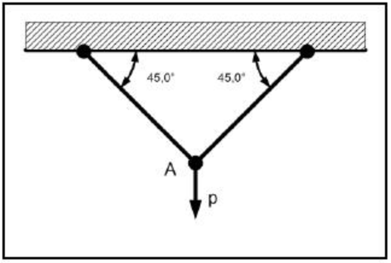
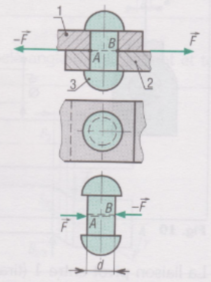

# RÉSISTANCE DES MATÉRIAUX - EXERCICES

## Exercice 1

**Déterminer** la charge axiale maximale que peut supporter un poteau en béton C25/30 de section 250x250 mm?

## Exercice 2

**Vérifier** la résistance d'un poteau cylindrique en bois C18 de diamètre 14 cm supportant une charge axiale F = 3600 daN.

## Exercice 3

**Déterminer** la section carrée nécessaire pour qu'un poteau en bois C24 résiste à une charge axiale de 12 kN.

## Exercice 4

**Vérifier** sa résistance d'un poteau HEA160 en acier S235, sollicité par une charge de 58 kN.  

## Exercice 5

Un poteau cylindrique en béton armé C25/30 reprend une charge de 1,3 MN.   
**Déterminer** son diamètre minimal. _On arrondira au 10 cm supérieur._

-----
## TRACTION / COMPRESSION

### Exercice 1

Un câble en acier S185 de diamètre 6mm et de longueur 10m est soumis à 2 forces de 200daN qui tendent à l'allonger.    

* a. Quel est le type de contrainte supporté par le câble?
* b. Quelle est la valeur de cette contrainte?
* c. Quelle est la valeur de l'allongement de ce câble?

### Exercice 2

Une barre prismatique de section rectangulaire (25 mm x 50 mm) et de longueur 1 = 3,5 m est soumise à une traction axiale de 90 kM. On observe un allongement de 1,2 mm. 
**Calculer** la contrainte axiale ainsi que l'allongement relatif. Que vaut le module de Young ?

### Exercice 3

Deux tronçons (1) et (2) en matière plastique sont collés comme l'indique la figure ci-dessous.   
La résistance à la rupture par traction de la colle est de 235 daN/cm$^{2}$ pour des températures comprises entre -60 °C et 120 °C.   
Si la section collée est rectangulaire et mesure 50 x 70 mm, **déterminer** l'effort de traction admissible par le joint collé.

{: width=100%}

### Exercice 4

Deux barres d'acier identiques de 2,5 m de longueur sont assemblées par des broches ($\equiv$ articulation) et supportent une masse de 50000 kg à leur extrémité comme représenté sur la figure ci-dessous.    
**Calculer** la section des barres telle que la contrainte subie ne soit pas plus grande que 210 N/mm$^{2}$.    
*On donne le module de Young E = 210000 N/ mm$^{2}$*

{: width=70%}

## CISAILLEMENT

### a/ Assemblage rivetés

{: width=50%}

Pour certains types de construction (carlingues d'avion, etc.), les assemblages rivetés sont préférés aux assemblages soudés plus sensibles au phénomène de fatigue.    

^^Exemple :^^ les barres (1) et (2) sont liées par un rivet (3) en aluminium de diamètre d = 10 mm et de résistance à la rupture par glissement R$_{g}$ = 10 daN.mm$^{-2}$.    
**Déterminons** l'effort $\overrightarrow{F}$ admissible.    

^^Résolution:^^   
Nous avons une seule section cisaillée.

### b/ Assemblages boulonnés

{: width=50%}

Le mode de calcul et les remarques sont identiques aux assemblables rivetés.   

^^Exemple :^^ pour l'assemblage proposé, à trois boulons ajustés en acier, d = 12 mm, la contrainte admissible au cisaillement des boulons R$_{pg}$ = 30 daN.mm$^{-2}$.   
**Déterminons** l'effort $\overrightarrow{F}$ admissible.

### c/ Articulation cylindrique

{: width=50%}

Une articulation cylindrique entre deux barres plates 1 et 2 est réalisée comme l'indique la figure.    
La liaison est assurée par un axe cylindrique 3 de diamètre $d$ inconnu. L'effort maximal supporté par la liaison est de 5000 daN.
La résistance pratique (ou admissible) au cisaillement du matériau de l'axe est de 5 daN.mm$^{-2}$.    
**Déterminer** le diamètre d de l'axe 3.    
**Indiquer** la (ou les) section(s) cisaillée(s).

## FLEXION

### Étude d'une poutre métallique « U »

Une passerelle est constituée de deux poutrelles métalliques en « U » supportant un platelage en bois et des gardes corps, de 1,20m de largeur et d'une travée de 4m, elle est essentiellement utilisée pour le passage des piétons.    
Pour assurer la stabilité et la dilatation de la structure, le bureau étude technique a opté pour un appui glissant à une extrémité et liaison articulée de l'autre.    

{: width=100%}

1/ On propose l'étude d'une de ces deux poutres « Poutre 1 » :

La charge lineique totale (permanente et d'exploitation) appliquée sur chacun des profilés est de P = 3,50 kN/ml.

{: width=70%} {: width=29%}

Acier S235 ; Flèche limite L/200

* **Vérifier** les conditions de rupture ?
* **Vérifier** les conditions de déformation ?
* **Conclure** sur l'évolution des contraintes dans la poutre AB ?