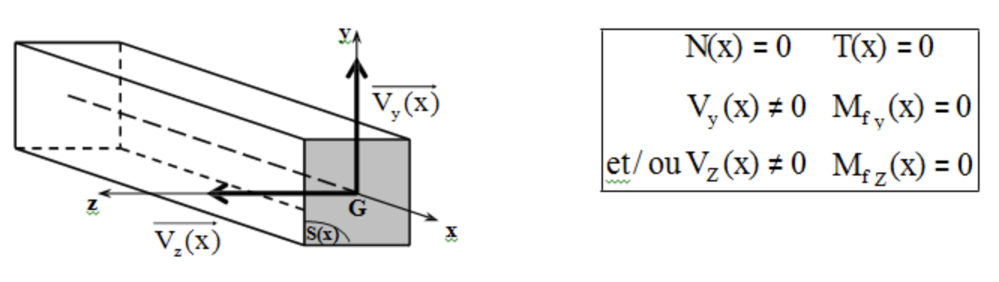

# LA RÉSISTANCE DES MATÉRIAUX

## LA THÉORIE DES POUTRES

### 1) Définition
On appelle _**poutre**_ un solide engendré par une aire plane (**S**) dont le centre de gravité **G** décrit une courbe (G$_{0}$ G$_{1}$).   
Le plan de (**S**) restant perpendiculaire à cette courbe.     

{: width=500}     

avec :     

* (**S**) appelée _**section droite**_,
* (S$_{0}$) section origine,
* (S$_{1}$) section extrémité,
* (**G$_{0}$ G$_{1}$**) est la _**fibre moyenne**_ de la poutre **G$_{0}$ G G$_{1}$** S$_{0}$ S S$_{1}$

### 2) Hypothèses fondamentale de la théorie des poutres

#### 1/ Hypothèses sur la géométrie des poutres

Trois hypothèses sur la géométrie des poutres:

* le rayon de courbure de la fibre moyenne est grand par rapport aux dimensions des sections  droites,
* la longueur de la fibre moyenne est grande devant les dimensions des sections droites (longueur supérieure à 10 fois la plus grande dimensions transversale), on parle de **solide élancé**,
* les éventuelles variations de l'aire de la section droite sont faibles et progressives.

#### 2/ Hypothèses sur le matériau

Les matériaux envisagés sont supposés:

* **homogènes** : tous les éléments du matériau, aussi petits soient-ils, ont une structure identique,
* **isotropes** : les propriétés mécaniques sont les mêmes en tous points et dans toutes les directions,
* **continus** : les propriétés varient de manière continue d'un point à l'autre,
* utilisés dans le **domaine élastique** : les relations entre les contraintes et déformations sont linéaires = _**loi de HOOKE**_

#### 3/ Hypothèses sur les déformations

_**Hypothèse de NAVIER-BERNOULLI**_ : "les sections planes normales aux fibres avant déformation restent planes et normales aux fibres pendant et après la déformation."

#### 4/ Hypothèses sur les actions extérieures

_**Hypothèse de SAINT-VENANT**_ : les résultats de la résistance des matériaux ne s'appliquent valablement qu'à une distance suffisamment éloignée de la région où sont appliqués les efforts concentrés.

## TORSEUR DE COHÉSION

### 1) Efforts Internes

Nous allons, dans ce paragraphe, déterminer quels sont les efforts qui se développent à l'intérieur de la matière.

* Appelés efforts intérieurs, _**efforts internes**_ ou encore _**efforts de cohésion**_ 
* ils assurent la cohésion (la liaison) entre les particules constitutives du matériau.

### 2) Notions de coupures

Soit une poutre droite en équilibre soumises à des actions extérieures quelconques Fi et à des actions de liaisons quelconques Ri.

{: width=500}  

Pour connaître ce qui se passe à l'intérieur de la poutre, on effectue par la pensée à l'abscisse x, une coupure fictive au droit d'une section notée S(x).

Isolons le tronçon de poutre situé à gauche de la section S(x). Ce tronçon est en équilibre sous l'action :

* des forces extérieures qui lui sont appliquées $\underset{Fi}{\rightarrow}$,
* des actions de liaisons $\underset{Ri}{\rightarrow}$,
* des forces que le tronçon de droite (2) exerce sur le tronçon de gauche (1). Ces forces se développent à l'intérieur du matériau.

On peut exprimer ces "efforts internes" sous la forme d'un torseur pris au centre de gravité de la section S(x).

Tronçon de gauche (1) isolé : 

{: width=500} 

Action du tronçon de droite (2) sur le tronçon de gauche (1) = torseur des efforts internes de cohésion : 

$\begin{Bmatrix}\tau_{(2/1)} \end{Bmatrix} = \begin{Bmatrix}\overrightarrow{R_{2/1}(X)}
\\ \overrightarrow{M_{G2/1}(X)}
\end{Bmatrix}_{G}$

Le torseur des efforts internes de cohésion s'écrit alors : 

$\begin{Bmatrix}\tau_{(2/1)} \end{Bmatrix} = \begin{Bmatrix}\overrightarrow{R_{2/1}(X)}
\\ \overrightarrow{M_{G2/1}(X)}
\end{Bmatrix}_{G} = \begin{Bmatrix} N(x) & T(x) \\ V_{y}(x) & M_{fy}(x) \\ V_{z}(x) & M_{fz}(x)\end{Bmatrix} _{G}$   

$\overrightarrow{R_{2/1}(X)} = N(x).\vec{x} + V_{y}(x).\vec{y} + V_{z}(x) . \vec{z}$

$\overrightarrow{M_{G2/1}(X)} = T(x).\vec{x} + M_{fy}(x).\vec{y} + M_{fz}(x) . \vec{z}$

Ce torseur correspond à un torseur d'encastrement.

**REMARQUE :** les problème que nous sommes amenés à traités sont des problèmes plan, tous les efforts extérieurs étant situés dans le plan (O, x, y). Dans ces conditions, les seules composantes non nulles du torseur des sollicitations sont: 

* l'effort normal N(x),
* l'effort tranchant suivant y, V$_{y}$(x), que nous noterons V(x),
* le moment fléchissant suivant z, M$_(fz)$(x), que nous noterons M(x), représentés de la façon suivante :    
{: width=50%} 

## LES SOLLICITATIONS OU COMPOSÉS

{: width=100%} 

### 1) Traction / Compression

#### Effort normal

On considérera qu'une poutre est sollicitée en traction simple ou en compression simple lorsque les éléments de réduction du torseur des efforts internes de cohésion se ramène à un seul effort normal N :

| Schémas | Sollicitation |
| -- | -- | 
| {: width=50%} | $N(x) \neq 0$ $T(x)=0$   $V_{y}(x)=0$ $M_{fy}(x)=0$   $V_{z}(x)=0$ $M_{fz}(x)=0$    N(x)>0 : traction simple,   N(x)<0 : compression simple |

Torseur des efforts internes de cohésion : $\begin{Bmatrix}\tau_{(2/1)} \end{Bmatrix} = \begin{Bmatrix} N(x) & 0 \\ 0 & 0 \\ 0 & 0 \end{Bmatrix}_{G}$

#### Loi de comportement des matériaux

Essai de traction sur une éprouvette en acier doux

Considérons une barre d'acier doux de longueur initiale L$_{O}$ et dont la section initiale S$_{0}$ est constante sur la longueur L$_{0}$.

Soumettons cette barre à une sollicitation de traction en lui appliquant à chaque extrémité un effort F :

{: width=50%} 

On peut enregistrer à l'aide de comparateurs l'allongement $\Delta$L est appelé l'**allongement absolu**.

Pour pouvoir comparer les caractéristiques mécaniques des matériaux, celles-ci doivent être établies indépendamment des sections S$_{0}$ et longueur L$_{0}$ des éprouvettes.

Ainsi, on reporte sur un graphique :

* en abscisse : l'allongement relatif $\varepsilon_{x} = \frac{\Delta L}{L_{0}}$ ($\varepsilon  =$ lettre grecque "epsilon"),     
    $\varepsilon$ est sans unité puisque c'est le rapport de deux longueurs,
* en ordonnée : la contrainte $\sigma = \frac{F}{S_{0}}$ ($\sigma =$ lettre grecque "sigma").     
    $\sigma$ est l'effort par unité de surface en N/mm$^{2}$, ou MPa.

##### Courbe contrainte / déformation

On obtient alors la "courbe contrainte - déformation" du matériau de l'essai qui a l'allure suivante :

{: width=100%} 

##### Loi de HOOKE

* ^^Partie OA :^^ la courbe est sensiblement **rectiligne**, ce qui signifie que la **déformation est proportionnelle à l'effort** exercé (ou que **l'allongement relatif est proportionnel à la contrainte**). (OA = droite de pente E)
    Dans cette zone, si on décharge l'éprouvette, elle revient à sa longueur initiale, comme un ressort. On dit que le matériau a, dans cette phase, un comportement élastique linéaire.
    
    Ceci se traduit par la loi de Hooke : $\frac{F}{S} = E \times \frac{\Delta L}{L}$ ou $\sigma = E \times \varepsilon$

    E est le module d'Young, ou **module d'élasticité longitudinal ($E_{x}$)**, du matériau et caractérise la rigidité du matériau.
    E s'exprime en MPa

    Le point A marque la fin de la zone élastique de la courbe. La contrainte $\sigma_{e} = \frac{F_{e}}{S}$ correspondante est appelée la **limite d'élasticité**.

* ^^Partie AD :^^ au-delà du point A, on rentre dans le domaine des grandes déformations, le **domaine plastique**, où les allongements ne sont plus proportionnels aux efforts. A ce stade, si on décharge l'éprouvette, celle-ci ne retrouve pas sa longueur initiale, on constate un **allongement résiduel**, c'est-à-dire une déformation permanente.
* ^^Entre A et B :^^ l'éprouvette s'allonge alors que l'intensité de la charge ne varie pratiquement pas, cette partie de la courbe est appelée « **palier plastique** ».
* ^^Au-delà de B :^^ on observe un allongement important pour une faible augmentation de la contrainte. La courbe se relève jusqu'à un maximum C qui correspond à la limite de rupture $\sigma_{r}$. A ce stade, on observe une diminution de la section de la barre dans la zone où va se produire la rupture, c'est le **phénomène de striction**. Puis la rupture intervient (point D).

_**Généralisation :**_

Pour définir les caractéristiques mécaniques des matériaux, on réalise des essais sur des éprouvettes : 

* traction directe sur les métaux,
* traction par flexion, par fendage ou directe pour les mortiers et les bétons,
* compression sur les bétons,
* traction, compression, flexion sur les bois.

Tous ces essais font apparaître deux phases :
 
* **une phase de déformation élastique** linéaire pour laquelle s'applique la loi de Hooke et où les déformations sont réversibles,
* **une phase de déformation plastique** où les déformations sont partiellement permanentes.

#### Notion de contrainte

Dans une section de poutre, les sollicitations sont les éléments de réduction des forces internes de cohésion au centre de gravité de la section. Elles permettent de savoir quelle est la section la plus sollicitée mais ne donnent aucune indication sur ce qu'il se passe en chaque point section. Pour cela, il faut introduire la notion de contraintes.

{: width=100%} 

Le vecteur contrainte est donc le rapport d'une force à une surface : l'intensité d'une contrainte est homogène à une pression et s'exprime en Pa.

#### Contrainte due à l'effort normal

Sur une section droite S (facette perpendiculaires à la fibre moyenne), suffisamment éloigné des points d'application des charges extérieures, on peut considérer que l'action de l'effort normal est une répartition uniforme de contrainte normales :

{: width=100%} 

Le signe de N est défini par rapport à l'orientation de l'axe (G,x) :

* si N > 0 : effort normal de **traction**, $\sigma$>0,
* si N < 0 : effort normal de **compression**, $\sigma$<0,

#### Déformations dues à l'effort normal

Isolons un tronçon élémentaire de poutre de longueur dx. Ce tronçon est compris en tre les sections S$_{i}$ et S$_{i+1}$.

Sous l'effet de l'effort normal, chaque fibre du tronçon subit une déformation $\Delta dx$.

Chaque fibre de poutre étant considérée indépendamment l'une de l'autre, on leur applique la loi de Hooke : $\sigma = E \times \varepsilon_{x}$ ou $\frac{N(x)}{S} = E \times \frac{\Delta dx}{dx}$

Tous les tronçon de fibres de longueurs dx subissent une déformation : $\Delta dx = \frac{N(x)}{SE}dx$

Ce qui signifie que la section se déplace parallèlement à sa position d'origine. Cela est conforme à l'hypothèse de Bernoulli selon laquelle les sections droites restent droites après déformations.

* $\Delta dx$ correspond à un allongement si N(x) > 0 (Traction),
* $\Delta dx$ correspond à un raccourcissement si N(x) < 0 (Compression),

#### Dimensionnement

##### 1/ Condition de résistance

Dans les conditions normales d'utilisation, on doit vérifier que la contrainte maximale $\sigma_{max}$ dans la section la plus sollicitée de la poutre reste inférieure à une valeur $\bar{\varepsilon}$ (contrainte admissible) fixée expérimentalement ou règlementairement.

Souvent, $\bar{\varepsilon}$ est calculée à partir de la limite d'elasticité $\varepsilon_{e}$ :

$\sigma_{max} = \frac{N_{max}}{S} \leq \bar{\varepsilon} = \frac{\sigma_{e}}{\gamma}$

Avec $\gamma$ ($\gamma =$ lettre grecque "gamma") un **coefficient de sécurité**.

^^_**Attention :**_^^ pour les **poutres élancées** soumises à de la **compression**, la vérification de la condition de résistance ne suffit pas, il faut se mettre à l'abris d'une ruine par flambement, phénomène d'instabilité de forme qui peut intervenir pour des efforts inférieurs à ceux que peut supporter le matériau (voir chapitre sur le flambement).

##### 2/ Condition de déformation

En fonction du type d'éléments, l'allongement ou le raccourcissement ne doit pas dépasser une limite admissible, qui, si elle était dépassée, compromettrait l'utilisation de l'ouvrage :     
$\Delta L \leq$ valeur fixée

### 2) Cisaillement simple

#### Effort tranchant

**Sollicitation étudiée : l'effort tranchant**

On considère qu'une section droite de poutre est soumise à un effort tranchant lorsque les éléments de réduction des efforts internes de cohésion se ramènent à la seule sollicitation V/

{: width=100%} 

Torseur des efforts internes de cohésion : $\begin{Bmatrix}\tau_{(2/1)} \end{Bmatrix} = \begin{Bmatrix} 0 & 0 \\ V_{y}(x) & 0 \\ V_{z}(x) & 0 \end{Bmatrix}_{G}

^^_Exemples d'éléments soumis à un effort tranchant :_^^

$\Rightarrow$ Fil de fer que l'on tente de sectionner

{: width=50%} 

$\Rightarrow$ Poutre appuyée sur un corbeau

{: width=50%} 

#### Contrainte de cisaillement simple

**Définition**

Soit une section droite par laquelle nous isolons la partie gauche d'une poutre. Supposons que la seule sollicitation à laquelle soit soumise cette section droite est un effort tranchant V$_{y}$.

{: width=100%} 

Chaque surface élémentaire dS subit une force d'intensité df due à l'action du tronçon de droite sur le tronçon de gauche.

Les forces $\overrightarrow{df_{i}}$ sont tangentes à S étant donné que la section n'est soumise qu'à un effort de cisaillement (il n'y a pas de force normale à S, donc pas de contrainte normale $\sigma$).

Chaque force qui s'applique sur une surface dS permet de définir une contrainte tangentielle
ou contrainte de cisaillement : $\tau = \frac{df_{i}}{dS}$ en MPa.

En cisaillement simple, on peut considérer que la répartition des contraintes de cisaillement est uniforme dans la section : $\tau = \frac{V}{S}$

^^_Attention :_^^ **ce n'est pas le cas en cosaillement de flexion** (effort tranchant concomitant à un moment fléchissant). C'est ce que nous allons voir dans la suite du chapitre.

### 3) Flexion

#### 1/ Sollicitation étudiée : Moment fléchissant

On considérera qu'une poutre (on se limite à l'étude des poutres droites) est soumise à de la flexion pure lorsque les éléments de réduction des efforts internes de cohésion se ramènent à
un seul moment fléchissant (autour de l'axe G$_{z}$ par exemple) M$_{z}$ :

{: width=100%} 

Torseur des efforts internes de cohésion : $\begin{Bmatrix}\tau_{(2/1)} \end{Bmatrix} = \begin{Bmatrix} 0 & 0 \\ 0 & 0 \\ 0 & M_{z}(x) \end{Bmatrix}_{G}$

