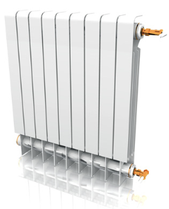
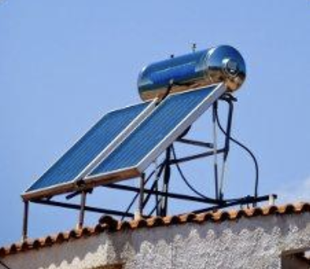

# CONFORT THERMIQUE - EXERCICES

## EXERCICE 1 : Chauffage d'une masse d'eau

{: width=30%}  

L’eau d’une piscine d’un volume de 600 m$^{3}$ est à une température de 12°C.    
Pour pourvoir se baigner on doit chauffer l’eau à 28°C.    
On dispose pour cela d’une chaudière de 400kW.   

| Données | |
| -- | -- |
| Capacité thermique massique de l'eau | $C_{eau}$ = 4185J.Kg$^{-1}$.K$^{-1}$ |
| Masse volumique de l’eau | $\rho_{eau}$ = 1000kg.m$^{-3}$ |

1. **Calculer** l’énergie nécessaire pour chauffer la piscine.    
2. En combien de temps l’eau sera-t-elle à la bonne température ?

## EXERCICE 2 : Radiateur

{: width=30%} 

Le débit d'eau dans un radiateur est noté $q'_{v}$. L'eau chaude pénètre dans le radiateur à la température $\theta_{1}$.     
Elle ressort à la température $\theta_{2}$. L'installation comporte dix radiateurs.     
La chaudière récupère l'eau ,provenant des radiateurs, à la température $\theta_{3}$ et la réchauffe à la température $\theta_{4}$.     

| Données | |
| -- | -- |    
| $q'_{v}$ | 0,035L.s$^{-1}$ |
| $\theta_{4}$ | 75°C | 
| $\theta_{3}$ | 55°C | 
| C | 4185J.kg$^{-1}$.°C$^{-1}$ |

1. **Calculer** la masse d’eau traversant les 10 radiateurs en 1 minute    
2. **Calculer** la quantité de chaleur Q dégagée par les 10 radiateurs en une minute.    
3. **Calculer** la puissance d’un radiateur.    
4. La chaudière utilise comme combustible du gaz. Le rendement de la combustion est de 80%. La chaleur de combustion de ce gaz est 890kJ.mol$^{-1}$. Le volume molaire de ce gaz, mesuré dans les conditions de combustion est 24L.mol$^{-1}$.     
   **Calculer** le volume du gaz brûlé.

## EXERCICE 3 : Chauffe eau solaire

{: width=30%} 

Notre capteur solaire est constitué de tubes peints en noir, placé derrière une vitre.    
Un essai d'utilisation de cet appareil, pendant une période ensoleillée, a donné les résultats suivants :

| Données | |
| -- | -- | 
| Débit de l'eau circulant dans le capteur | 20L.h$^{-1}$ |
| Température d'entrée de l'eau | 15°C |
| Température de sortie de l'eau | 40°C |

On se propose de résoudre l’exercice en utilisant 2 méthodes:     
- une en partant de la formule d’énergie Q= …     
- l’autre en utilisant la formule de puissance P=…

{: width=50%} 

1. Méthode 1 : **calculer** la masse d’eau circulant en une heure dans le capteur.     
**En déduire** l’énergie reçue (chaleur) en une heure par le capteur (exprimer le résultat en kJ et en kW.h)

2. Méthode 2 : **calculer** la puissance thermique du chauffe-eau lors de cet essai (attention aux unités).     
   **Calculer** la quantité de chaleur absorbée par l'eau circulant dans le capteur pendant une heure (exprimer le résultat en kJ et en kW.h).

3. **Calculer** l'énergie solaire reçue en une heure par le capteur de 2 m$^{2}$ sachant que la puissance solaire disponible pendant la période d'essai est de 800W.m$^{-2}$

4. **Calculer** le rendement du capteur solaire (on travaillera avec les énergies).     
   Qu’en pensez-vous ?

## EXERCICE 4 : Chauffe eau électrique

Un ballon d'eau chaude électrique a une capacité de 240L.     
Le réchauffage de l'eau s'effectue en tarif de nuit de 22H30 à 6H30.     
L'eau est portée de 10°C à 85°C.    

| Données | |
| -- | -- |
| Capacité thermique massique de l'eau | $C_{eau}$ = 4186J.kg$^{-1}$.K$^{-1}$ | 
| Masse volumique de l’eau | $\rho_{eau}$ = 1000kg.m$^{-3}$ |

1. Quelle est l'énergie nécessaire au chauffage du ballon ?
2. Quelle est la puissance électrique minimum du chauffe eau ?
3. **Calculer** le coût si le kWh est facturé 0,08934 Euro TTC.
4. À 6H30, on effectue un premier puisage de 80L. Le remplissage se fait avec de l'eau à 10°C.    
   **Calculer** la température finale de l'eau du ballon.
5. À 12h30, on mesure la température de l'eau à 57°C. 
   En déduire l’énergie perdue et la puissance moyenne perdue.

## EXERCICE 5 : Simple / double vitrage

Certaines fenêtres à double vitrage possèdent deux vitres parallèles séparées par un gaz tel que l'argon. Elles permettent de mieux isoler les pièces d'une maison. La conduction est le mode prépondérant de transfert d'énergie à travers un double vitrage.    
On précise que dans le cas d'une paroi composite, c'est à dire formée de plusieurs couches de matériaux différents, la résistance thermique totale est la somme des résistances des différentes couches.

{: width=30%} 

| Conductivités thermiques | |
| -- | -- |
| $\lambda$ (air) | 0,026W.m$^{-1}$.K$^{-1}$ |
| $\lambda$ (argon) | 0,017W.m$^{-1}$.K$^{-1}$ |
| $\lambda$ (verre) | 1,2W.m$^{-1}$.K$^{-1}$ |
| Température intérieure | 20°C |
| Température extérieure | 5°C |

1. En considérant une surface vitrée de 1 m$^{2}$, **calculer** la résistance thermique de chacune des 3 parois composant le double vitrage.
2. **Déterminer** la résistance totale du double vitrage.
3. Quelle est la valeur du flux thermique qui le traverse ?
4. **Comparer** cette valeur avec celle du flux traversant un simple vitrage d'épaisseur 8mm.
5. **Dégager** l'intérêt du double vitrage par rapport au simple vitrage.
6. Pourquoi utilise-t-on de l’argon plutôt que de l’air ?

## EXERCICE 6 : Isolation d’un mur

{: width=30%} 

Le mur extérieur d'une maison est constitué de briques. Il est sans ouverture et mesure 6 mètres de hauteur, 10 mètres de longueur et 20 centimètres d’épaisseur.

1. La conductivité thermique de la brique est λ = 0,67W.m$^{-1}$.K$^{-1}$.     
   **Calculer** la résistance thermique du mur et le flux thermique lorsque la température extérieure est de 0°C, celle de la maison étant maintenue à 20°C.
2. Pour diminuer les déperditions thermiques, on isole le mur par 45 millimètres de polystyrène de conductivité thermique $\lambda'$ = 0,029W.m$^{-1}$.K$^{-1}$.     
   **Calculer** le nouveau flux thermique.
3. Quel serait ce flux thermique, si le mur était constitué de deux parois en brique, de 8 centimètres d'épaisseur chacune, séparées par une couche d'air de 4 centimètres ?     
   La conductivité thermique de l'air est λ air = 0,026 W.m$^{-1}$.K$^{-1}$.     
   **Conclure**.

## EXERCICE 7: Étude de la consommation d’une automobile

Le plein d’une automobile est considéré comme correspondant à une énergie de 400kW.h. La combustion est traditionnelle (PCI).

1. **Compléter** le tableau de combustible nécessaire pour avoir un plein complet (en donnant des exemples de calcul):

| Combustible | Masse  (kg) | Volume  (L) | Masse de CO2   émisse durant   la combustion   (kg.GJ$^{-1}$) | 
| :-: | :-: | :-: | :-: |
| Gaz naturel |  |  |  |
| Essence |  |  |  |
| Gazole |  |  |  |
| Granulés de bois |  |  |  |
| Charbon |  |  |  |

2. **Analyser** les résultats en termes de masse et de volume.
3. **Analyser** les résultats en termes de CO$^{2}$ émis.
4. Sachant qu’en moyenne une automobile fait 700km par plein, **calculer** l’énergie que consomme notre voiture par km (kwh/km)
5. Sachant qu’une voiture parcoure 14000km par an en moyenne et qu’il y a 36 millions d’automobiles en France, **calculer** l’énergie totale nécessaire en France pour alimenter les automobiles.
6. Sachant qu’une tranche de centrale nucléaire fournit annuellement 6 millions MWh, combien faudrait-il construire de centrales nucléaires (tranches) pour électrifier l’ensemble des automobiles françaises ?