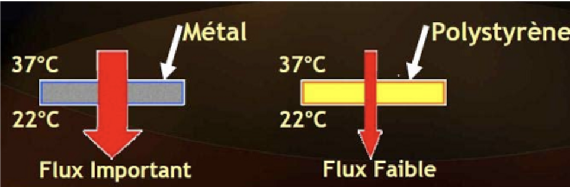

# CONFORT THERMIQUE - COURS

## EXPERIENCE ET UNITÉS

### Energie thermique / Calorimétrie

La calorimétrie a pour but de mesurer la quantité de chaleur (énergie thermique) absorbée ou diffusée par un corps. Les mesures sont basées sur des échanges thermiques par relevé de  températures.
 
### Expérience

Si on chauffe une tige de cuivre à une extrémité, la chaleur se propage à l’autre extrémité.

#### Interprétation 

La chaleur s’interprète à l’échelle microscopique par une agitation atomique. Un solide est un assemblage d’atomes en perpétuelles agitations. Plus l’agitation est grande plus le dégagement de chaleur sera important.

Il existe trois formes de transfert de la chaleur :

* **La conduction :** la chaleur se propage par agitation de proche en proche des atomes du solide (expérience précédente).     
  Plus la densité du solide est grande, meilleure sera la conduction.
* **La convection :** la chaleur se transmet par mouvement et mélange de matière chaude et de matière froide (liquides et gaz).     
  Par exemple l’air chaud monte et l’air froid descend.
* **Le rayonnement :** le transfert se fait par rayonnement électromagnétique (par exemple : infrarouge).     
  Le corps en contact avec ce rayonnement s’échauffe.

### Les unités de température

{: width=50%} 

L'unité légale de température dans le système international est le kelvin de symbole K (noter l'absence du symbole °). Il existe d'autres systèmes de mesures toujours utilisés : degrés Celsius et Fahrenheit

#### Le degré Celsius

C'est le kelvin auquel on retire 273,15K. Son unité est le °C. Elle est une simple translation de l'échelle absolue (« les barreaux de l’échelle » ont la même valeur donc 1°C = 1K. Du coup s’il l’on fait une différence de température, la valeur est la même en °C qu’en K)

#### Le Fahrenheit

Son symbole est °F. Elle attribue une plage de 180°F entre la température de solidification de l'eau et sa température d'ébullition. Son échelle n’est donc pas la même que les autres (ni la référence du zéro, ni les espaces entre « les barreaux de l’échelle »)

### Tableau de conversion 

| Conversion de | vers | Fonction |
| -- | -- | -- |
| Fahrenheit | Celsius | $°C = \frac{(°F-32)}{1,8}$ |
| Celsius | Fahrenheit | $°F = °C \times 1,8 + 32$ |
| Fahrenheit | Kelvin | $K = \frac{(°F-32)}{1,8}+273,15$ |
| Kelvin | Fahrenheit | $°F = (K - 273,15) \times 1,8 +32$ |

## GRANDEUR CALORIMÉTRIQUES (CONDUCTION)

### Quantité de chaleur (énergie) et capacité thermique massique

Soit Q la quantité de chaleur ou énergie (en Joules) nécessaire pour élever la température d’un corps de masse m de la température $\theta_{i}$ à la température $\theta_{f}$ :

| Formules | Détails |
| :-: | -- |
| $Q = m \times c \times (\theta_{f}-\theta_{i})$   ou   $Q = m \times c \times (\Delta\theta)$ | ^^Avec:^^   **Q :** quantité de chaleur (énergie) en joules (J)   **m :** masse à chauffer en kilogrammes (kg)   **c :** capacité thermique massique (J.kg-1.K-1)   **θi et θf :** températures en degrés Celsius ou Kelvin (°C ou K) |

Où **c** est une caractéristique constante du corps chauffé.     
On l’appelle capacité thermique massique ou chaleur massique.     
C’est la quantité d'énergie qu'il faut fournir à un matériau pour élever sa température, exprimée en J.kg$^{-1}$.K$^{-1}$.

^^Remarque:^^    
Quelques fois on utilise K, capacité thermique:     
$K = m \times c$     
(K est en J.K$^{-1}$)   
K varie donc avec la masse du corps.

Dans les applications on travaille souvent avec un fluide dit **caloporteur**. La donnée principale est alors le débit Q$_{v}$. On transforme alors la formule :

| Calculs | |
| -- | -- |
| $Q = m \times c \times (\theta_{f}-\theta_{i})$ | |
| $\frac{Q}{t} = \frac{m \times c \times (\theta_{f}-\theta_{i})}{t} $ | or $m = \rho \times v$   ($\rho$ = masse volumique et v = volume) |
| $\frac{Q}{t} = \frac{v \times \rho \times c \times (\theta_{f}-\theta_{i})}{t}$ | or $\frac{Q}{t} = P$   et $\frac{v}{t} = Qv$ (Débit) |
| $P = Qv \times \rho \times c \times (\theta_{f}-\theta_{i})$ | ^^Avec:^^   P = puissance en Watts (W)   Qv = débit en m$^{3}$.s$^{-1}$   $\rho$ = masse volumique (kg/m$^{3}$ ou kg.m$^{-3}$)    c : capacité thermique massique (J.kg$^{-1}$.K$^{-1}$)   ($\theta_{f}-\theta_{i}$)= $\Delta\theta$ en degrés Celsius ou Kelvin (°C ou K) |

### Notion de flux thermique et de résistance thermique

Le flux thermique ou flux de chaleur correspond au transfert thermique qui s'effectue entre 2 milieux (ayant des températures différentes bien évidemment)

{: width=50%} 

| Loi | |
| -- | -- |
| $\Delta T = T \times \phi$ | ^^Avec :^^  $\Delta T$ exprimé en Kelvin (ou en ° Celsius car on a une différence  ΔT)   R est la résistance thermique de la paroi en K.W$^{-1}$   $\phi$ est le flux thermique en Watts (W) |

^^Remarques:^^    
La résistance thermique caractérise l’aptitude d’un matériau à s’opposer au passage de la chaleur (analogie électrique :     

* R$_{th}$ correspond à R
* le flux $\phi$ au courant électrique I
* $\Delta T$ appelé gradient de température correspond à la tension électrique
     
Pour des matériaux traversés par un même flux thermique, la résistance thermique totale est la somme des résistances thermiques.    
Les professionnels du bâtiment utilisent la résistance thermique intrinsèque R$_{i}$ qui est une grandeur indépendante de la surface exposée au flux :     
R$_{i}$ = S $\times$ R (exprimé en m$^{2}$.K.W$^{-1}$).

### Notion de conductivité thermique

En général, les matériaux sont définis par leur conductivité thermique ($\lambda$ : capacité d'un matériau donné à transmettre la chaleur par conduction, exprimée en W.m$^{-1}$.K$^{-1}$).     
La conductivité thermique varie en fonction de la température donc en générale elle est donnée pour une valeur proche du l’utilisation.

| Lien entre R et $\lambda$ | |
| -- | -- |
| $R = \frac{e}{\lambda \times S}$ | ^^Avec :^^   e  = épaisseur (en m)   S = surface (en m$^{2}$)   R est la résistance thermique la paroi en K.W$^{-1}$   $\lambda$ est la conductivité thermique en W.m$^{-1}$.K$^{-1}$ |

| Matériau | Conductivité   thermique $\lambda$ (à 20°C) | Capacité calorifique c   (J/kg.K) | Densité   (kg/m$^{3}$) |
| -- | :-: | :-: | :-: |
| Cuivre pur | 398 | 386 | 2710 | 
| Béton | 0,8 à 1,7 | 880 | 1900 à 2300 | 
| Brique | 0,4 à 0,7 | 840 | 1600 à 1800 |
| Bois (Chène, pin   contreplaqué...) | 0,11 à 0,3 | 2390 - 2700 | 400 à 800 |
| Laine de verre | 0,036 à 0,04 | 670 | 10 à 200 |
| Air sec à 20°C | 0,03 | 1004 | 1,2 |

^^Remarque :^^ Pour bien raisonner, il est plus facile de s'aider des unités.

## COMPARAISON DE QUELQUES SOURCES D'ÉNERGIE

| Combustible | *PCI (kJ.kg$^{-1}$) | *PCS (kJ.kg$^{-1}$) | Masse volumique   $\rho$ (kg.m$^{3}$) | Masse de CO$^{2}$ émisse  durant la combustion   (kg.GJ$^{-1}$) | 
| -- | :-: | :-: | :-: | :-: |
| Gaz naturel | 49700 | 55200 | 1,36 | 57 |
| Essence | 42700 | 47300 | 775 | 73 |
| Gazole | 42600 | 44800 | 850 | 75 |
| Fioul | 41992 | 44780 | 865 | 75 |
| Granulés de bois | 17450 | 18830 | 650 | 92 |
| Charbon | 36160 | 35360 | 1500 | 95 |

??? abstract "*PCI - PCS"
    **Le pouvoir calorifique inférieur (PCI) :**
    Pour les usages de combustion, l'une des caractéristiques énergétiques (thermiques, en l'occurrence) est le pouvoir calorifique : c'est la quantité d'énergie thermique qui est libérée par la combustion dudit combustible, généralement ramenée à une unité de masse. Ainsi, pour reprendre l'exemple de la tep, on peut dire que le pouvoir calorifique inférieur (PCI) du pétrole est de 11.67 MWh/tonne.

    **Le pouvoir calorifique supérieur (PCS)**
    Les combustibles habituels sont généralement des hydrocarbures, composés d'atomes d'hydrogène et de carbone. La combustion est en réalité une oxydation de l'hydrogène et du carbone. La combinaison du carbone avec l'oxygène de l'air produit du CO2, la combinaison de l'hydrogène avec l'oxygène produit de la vapeur d'eau (H2O). Dans certains cas (suivant le matériel et les conditions d'exploitation), on peut récupérer la chaleur de cette vapeur d'eau par condensation, c'est une technologie utilisée par des chaudières performantes (chaudières à condensation). Le cas échéant, on parle de pouvoir calorifique supérieur (PCS), qui est égal au pouvoir calorifique inférieur (PCI) + la chaleur latente de vaporisation de l'eau. Par exemple, pour du gaz naturel, le PCS est supérieur d'environ 11% au PCI