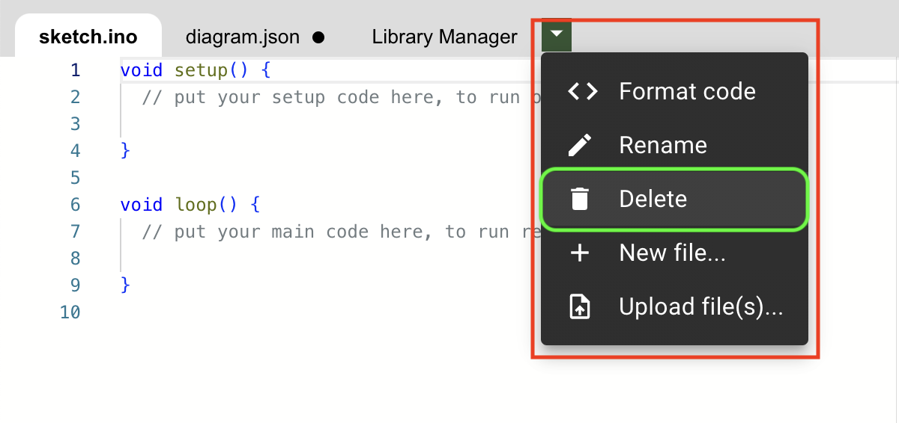

# (RE)DÉCOUVERTE DES CAPTEURS DANS UN SYSTÈME

## OBJECTIFS

Dans cette activité, vous allez (re)découvrir l’usage des capteurs à l’aide un microcontrôleur type Arduino.  

## À VOTRE DISPOSITION

Vous avez, à votre disposition :

* Vos camarades ;
* Vos enseignants ;
* Votre ordinateur et les logiciels installés et en ligne ;
* Vos écouteurs ;
* Une vidéo sur les diagrammes sysML au collège ;
* Une archive contenant une modélisation d'un montage composé d’un microcontrôleur type Arduino UNO avec deux capteurs.

## VOUS DEVEZ RÉALISER LES TÂCHES SUIVANTES

### 1. Comprendre les composants:

1. Regardez la [vidéo de « rappels »](./Ressources/sysML_college.mp4){:target="blank" } sur les diagrammes sysML.   
   _Vous pouvez vous limiter à la partie sur les diagrammes de définitions des blocs (à partir de 8:08 jusqu’à 9 :19)._   
2. Complétez le diagramme de définition des blocs fourni (fichier « [sysML_BDD.drawio](./Ressources/sysML_BDD.drawio) ») avec les noms des composants du montage.
3. Créez un **fichier de traitement de texte** afin de rassembler vos réponses.  
   Insérez-y votre diagramme de définition des blocs.  
   _Inspirez-vous (ou réutilisez) l’exemple fourni dans l'activité 1 de la séquence 1: "[Ingénierie des systèmes](../../Seq1/S1_Act1.md)"._

### 2. Observation des mesures

1. Télécharger les fichiers suivants:
      1. Fichier [INO](./Ressources/prog_act1.ino) (Programme du montage)
      2. Fichier [JSON](./Ressources/diagram.json) (Données du montage)
2. Ouvrir le lien du [MONTAGE ARDUINO](https://wokwi.com/projects/new/arduino-uno){:target="blank" }.
3. Supprimer les onglets ("sketch.ino" et "diagram.json") comme ci-dessous.
      {:width=500}
      {:width=500}
4. Importer les deux fichiers précédemment téléchargés. ("prog_montage.ino" et "diagram.json")  
   {:width=500}
5. Appuyer sur: 
      * le bouton "PLAY" du simulateur (Voir "1" sur image) ;
      * les capteurs (Voir "2" sur image) pour modifier les signaux qui seront affichées sur le moniteur de sortie .  
      {:width=400}
6. Décrivez succinctement les signaux observés.
7. Quelle différence notable observez-vous en analysant et comparant les deux signaux ?
8.  Faites une recherche pour identifier le type de chacun des capteurs et complétez un tableau du type :

    | Capteur | Nom | Grandeur mesurée |
    | -- | -- | -- |
    | Capteur A | ........................... | .................. |
    | Capteur B | ........................... | .................. |

9.  Pour chacun des capteurs, proposez deux utilisations pratiques possibles en précisant, dans chaque cas, le besoin auquel il répond.
10. Quels sont les types de capteurs que vous avez utilisés ? dans quel cas utilise-t-on l’un ou l’autre ?

