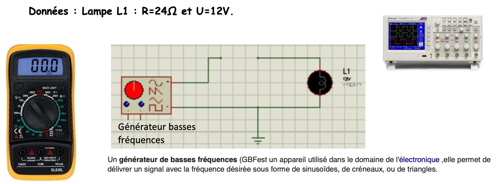

# DÉCOUVERTE DES APPAREILS DE MESURE DANS UN SYSTÈME

## OBJECTIFS

Dans cette activité, vous allez:

* Simuler des schémas de circuits électriques à l’aide d’un logiciel (ISIS PROTEUS ou TinkerCAD)
* Placer des appareils électriques (Ampèremètre, voltmètre ...)
* Interpréter les résultats et valider les lois physiques en électricité.

## À VOTRE DISPOSITION

Vous avez, à votre disposition:

* Vos camarades ;
* Vos enseignants ;
* L’ordinateur du lycée ou vos POPs et le logiciels ISIS PROTEUS ou TinkerCAD ;
* Des fichiers ISIS PROTEUS ou TinkerCAD

## VOUS DEVEZ RÉALISER LES TÂCHES SUIVANTES

### 1. Comprendre les appareils de mesure: Recherche internet.

1. Connaissez-vous des appareils de mesures ? Donner des exemples ?
2. Quel appareil permet de mesurer une tension, courant ? Comment fonctionne-t-il ?

### 2. Observation de différents montages.

#### Montage avec 1 seule lampe

1. On souhaite mesurer le courant et relever la tension de la lampe 1.   
   Sur l’image ci-dessous, **réaliser** les différents branchements entre les appareils et le schéma :
      * Le multimètre afin de mesurer le courant.
      * L’oscilloscope afin de relever la tension aux bornes de la lampe.
    
    Utiliser la couleur rouge et noir pour faire vos tracés.   
    **Indiquer** les différents réglages des appareils.  

    {: width=700}   

2. Ouvrir le logiciel Proteus 7 professionnel.  
   Cliquer sur fichier->Ouvrir projet « Lampe seule.DSN ».  
   Lancer la simulation en bas à gauche en appuyant sur _**PLAY**_.  
    
    Régler le GBF afin de produire une tension rectangulaire d’amplitude de 12V et de fréquence 1Hz.  

    {: width=700}   

    **Sur l’oscilloscope :**   
    Mettre les voies B, C et D sur OFF.   
    Régler la sensibilité verticale et la base de temps pour visualiser un signal.   

    {: width=700}   
    _« Il est possible d’effectuer des mesures de tensions et de temps avec les curseurs : valider Cursors. Sélectionner un point de départ, puis déplacer le curseur sans relâcher le bouton de la souris, suivant le sens horizontal ou vertical du déplacement, la tension ou le temps s’affiche. Pour effacer les curseurs : clic-droit puis Clear All Cursors. »_   
 

3. Qu’observez-vous sur le signal ?   
   Comment fonctionnent la lampe ?   
4. Mesurer une période à l’aide du curseur.   
   Quelle est le rapport cyclique ?    

---
#### Montage avec 2 lampes

{: width=700}   
On souhaite mesurer I, U$_{L1}$, U$_{L2}$, U$_{L1L2}$

1. **Ouvrir** le projet «Lampe Série.DSN».   
   **Compléter** le schéma avec les appareils de mesure, fermer le contact SW1 et lancer la simulation.

2. **Faire** varier U, relever U$_{L1}$, U$_{L2}$, U$_{L1L2}$ et I.   
   **Compléter** le tableau de mesure.  

    | U (en V) | 0 | 2 | 4 | 6 | 8 | 10 | 12 |
    | -- | :-: | :-: | :-: | :-: | :-: | :-: | :-: |
    | I (en A) |  |  |  |  |  |  |  |
    | U$_{L1}$ (en V) |  |  |  |  |  |  |  |
    | U$_{L2}$ (en V) |  |  |  |  |  |  |  |
    | U$_{L1L2}$ (en V) |  |  |  |  |  |  |  |    

3. À partir des résultats que peut-on dire de la valeur de U$_{L1L2}$ ?   
4. À l’aide d’un logiciel de tableur, **Tracer** la caractéristique U$_{L1L2}$ = f(I).
5. Quelle est la forme de la courbe obtenue ?
6. **Calculer** la pente correspondante.
7. En déduire la valeur de la résistance équivalente des 2 lampes.   
   **Comparer** avec R$_{L1}$ + R$_{L2}$. **Conclure**.

---
#### Montage en parallèle de 2 lampes

{: width=500}   
On souhaite mesurer I, UL1, I1et I2.

1. Ouvrir projet « Lampe parallèle.DSN».   
   **Compléter** le schéma avec les appareils de mesure, fermer le contact SW1 et lancer la simulation.

2. Faire varier U, relever I, UL1, I1et I2.   
   **Compléter** le tableau de mesure   

    | U (en V) | 0 | 2 | 4 | 6 | 8 | 10 | 12 |
    | -- | :-: | :-: | :-: | :-: | :-: | :-: | :-: |
    | I (en A) |  |  |  |  |  |  |  |
    | I$_{1}$ (en A) |  |  |  |  |  |  |  |
    | I$_{2}$ (en A) |  |  |  |  |  |  |  |
    | U$_{L1}$ (en V) |  |  |  |  |  |  |  |    

3. À partir des résultats que peut-on dire de la valeur de I ?   
4. À l’aide d’un logiciel de tableur, **Tracer** la caractéristique UL1 = f(I).  
5. Quelle est la forme de la courbe obtenue ?   
6. **Calculer** la pente correspondante.   

7. En déduire la valeur de la résistance équivalente des 2 lampes.   
   **Comparer** avec $\frac{R_{L1} \times R_{L2}}{R_{L1} + R_{L2}}$.   
   **Conclure**.