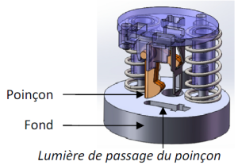

# Reconception GREEN-EMMA

## Reconception Solidworks de l'agrafeuse Green-Emma pour la rendre moins impactante que sa concurrente.

### Fichier à télécharger pour l'activité
[Maquette_SW_agrafeuse_Emma.zip](./ressources/Maquette_SW_agrafeuse_Emma.zip)

Pour diminuer les impacts de l'agrafeuse Green-Emma, l'on souhaite augmenter sa durée de vie. L'une des possibilités est de réduire l'usure de la pièce « fond » au niveau de la lumière de passage du « poinçon ». En effet, lorsque les feuilles sont agrafées, le « poinçon » métallique frotte sur le « fond » en plastique qui s'use ainsi prématurément.

{:width=30%}

Pour cela on se propose d'interposer une plaque en acier afin que la découpe de la feuille se fasse entre le poinçon et cette dernière.

{:width=30%}

1. Ouvrir le fichier de type assemblage "agrafeuse" avec le logiciel SolidWorks (fichier dans le dossier récupéré ci-dessus). Fermer le fichier.
2. Ouvrir le fichier "fond.sldprt" (fichier dans le dossier récupéré ci-dessus). A l'aide de Solidworks noter la masse de la pièce originale.
3. Modifier la pièce pour pouvoir y loger une plaque de dimensions 25 * 10 * 1,5 comportant une ouverture identique au passage du poinçon (Cf. méthode). A l'aide de solidworks noter la masse de la pièce "fond modifiée".
4. Créer la pièce plaque (Cf. méthode). Après avoir appliquer un matériau de type acier allié inoxydable , noter la masse de la pièce "plaque" que vous venez de créer (Cf. méthode).
5. Après avoir bien noté les nouvelles masses de la pièce "fond.sldprt" et de la plaque ajoutée, enregistrer votre travail.