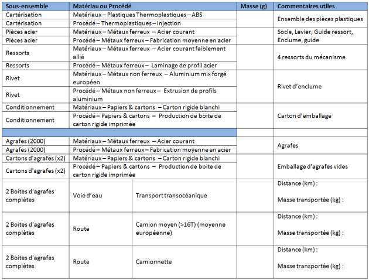

#  PRÉPARATION ÉTUDE SKREBBA

### ^^Question 5 :^^ 
A l'aide du document « [Document_ressource_Skrebba]() », **compléter** les informations manquantes du tableau ci-dessous pour l'agrafeuse Skrebba. Ces valeurs permettront d'analyser l'impact environnemental de l'agrafeuse.

{:width=100%}

