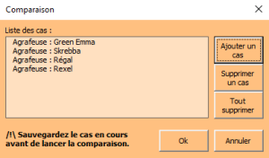

# COMPARAISON DES IMPACTS DES 4 AGRAFEUSES

Il faut maintenant comparer les 4 produits :

{:width=30%}

On donne les unités fonctionnelles suivantes pour les agrafeuses

* Green Emma avec un coefficient N UF GREEN EMMA = 20 : "Agrafeuse_Green_Emma_20.xls" ;
* Skrebba avec un coefficient N UF SKREBBA = 10 : "Agrafeuse_Skrebba_10.xls" ;
* Regal avec un coefficient N UF REGAL = 4 : "Agrafeuse_Regal_4.xls" ;
* Rexel avec un coefficient N UF REXEL = 2 : "Agrafeuse_Rexel_2.xls".

**Suivre** la [PROCÉDURE](./ressources/bilan_produit-comparer.pdf){:target="_blank"}.

### ^^Question 19 :^^
**Compléter** le tableau de classement en mettant « + + » pour le meilleur produit (le moins impactant), puis « + », « - » et « - - » en fonction de leurs performances.

{:width=100%}

### ^^Question 20 :^^
**Déterminer** le produit qui a l'impact le plus faible.

### ^^Question 21 :^^
**Déterminer** le produit qui a l'impact le plus négatif.