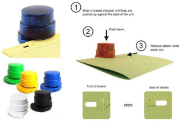
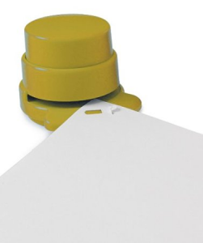

[^nbp]: [Source de l'activité](https://turgotlimoges.scenari-community.org/Ensil/01_ingenierie_analyse_systeme/TP_EcoConcAgrafeuse/co/module_TP_EcoConcAgrafeuse_v2_1.html)
# ANALYSE DU CYCLE DE VIE (ACV) AGRAFEUSES

## PRÉSENTATION

{:width=100%}

### OBJECTIFS

* Comprendre la notion d'Unité Fonctionnelle ;
* Déterminer les consommations (énergie, consommables) correspondant à l'unité fonctionnelle ;
* Estimer des impacts environnementaux, renseigner une feuille de calcul, s'appuyer sur une base de données ;
* Comparer des produits d'un point de vue environnemental pour une même phase du cycle de vie.

### MODALITÉS

* Durée: 3 heures

### RESSOURCES

* Données relatives aux différentes agrafeuses :
    * Lieu de fabrication ;
    * Estimation de la durée de vie ;
    * Consommables ;
    * Fabrication ;
    * Conditionnement ;
    * Livraison ;
    * Utilisation ;
    * Fin de vie ;
* Arocédure d'utilisation de « Bilan Produit » ;
* Manuel de référence du logiciel « Bilan Produit ».

## UNITÉ FONCTIONNELLE

**Consulter** la _Mise en Situation_ et les _Données relatives aux consommations des différentes agrafeuses_ :

??? info "MISE EN SITUATION"

    #### Les solutions d'agrafage
    Un rapport affirme que l'agrafeuse sans agrafes « Green Emma » est plus impactante pour l'environnement que l'agrafeuse « Skrebba », qui nécessite pourtant l'usage d'agrafes.   

    Cette affirmation a mis la société productrice de l'agrafeuse Green Emma dans l'embarras, car le slogan pour cette entreprise est justement de réaliser des produit peu impactant.  

    De ce fait, la société vous demande d'étudier leur produit et d'envisager des pistes pour améliorer le bilan.   

    On souhaite réaliser une étude comparative d'impact environnemental concernant différentes solutions d'agrafage.   

    La fonction à réaliser est donc : « assembler des feuilles ».

    On choisit quatre modèles différents.   

    {:width=100%}

    * Le premier modèle est une agrafeuse sans agrafe : Green Emma (d'une durée de vie estimée à 1 000 agrafages).
    * Le second modèle est une agrafeuse (majoritairement) en plastique : Skrebba (d'une durée de vie estimée à 2 000 agrafages).
    * Le troisième modèle est une agrafeuse en acier : Regal (d'une durée de vie estimée à 6 000 agrafages).
    * Le quatrième modèle est une agrafeuse électrique : Rexel (d'une durée de vie estimée à 10 000 agrafages).

    #### Définition d'une unité fonctionnelle
    Pour pouvoir comparer des produits, ils doivent être évalués pour un même service rendu appelé unité fonctionnelle (UF).

    Toutes les consommations des produits étudiés devront donc être exprimées uniquement pour la réalisation de cette unité fonctionnelle.

    On va définir une UF correspondant à l'ensemble du cycle de vie des produits étudiés.

    Pour les produits étudiés elle peut par exemple être définie de la façon suivante :

    **UF = « agrafer des feuilles deux fois par jour, 5 jours par semaine, 47 semaines par an pendant 42 ans ».**

!!! info "DONNÉES DE CONSOMMATIONS DES AGRAFEUSES"

    ??? abstract "GREEN EMMA"

        {:width=50%}

        * Lieu de fabrication : Allemagne (Lahr).
        * Estimation de la durée de vie : 1000 agrafages.
        * Consommables : aucun,
        * Fabrication : Masse des éléments (donnée par le fabricant et déjà saisie dans le logiciel)
        * Conditionnement : Emballage : Carton rigide blanchi.
        * Livraison : idem à l'agrafeuse Skrebba
        * Fin de vie : ordures ménagères.

        {:width=100%}

        | En image | Description |
        | -- | -- |
        | {:width=100%} | AGRAFEUSE SANS AGRAFES en PLASTIQUE RECYCLE marquée RRR   - Un système de génie pour fixer jusqu'à 4 feuilles de 80g entre elles sans agrafes.   - Plus jamais en panne d'agrafes.   - Un déchet de moins   - Fini les agrafes dans la poubelle papier   - Passe sans problème au destructeur de document |

        {:width=100%}
    
    ??? abstract "SKREBBA"

        {:width=50%}

        C'est une agrafeuse de bureau traditionnelle (avec cartérisation en plastique recyclé), fabriquée en Allemagne, d'une durée de vie estimée à 2000 agrafages.   

        #### Scénario d'utilisation
        Agrafeuse utilisée dans un bureau par une personne travaillant à temps complet pendant toute sa carrière (40 ans). En moyenne cette personne utilise son agrafeuse deux fois par jour, pendant 45 semaines par an avec 5 jours de travail par semaine.

        #### Caractéristiques
        
        * Lieu de fabrication : Allemagne (Lahr).
        * Estimation de la durée de vie : 2000 agrafages.
        * Consommables : boîte de 1000 agrafes,
        * Poids total (emballage inclus) : ≈ 92 g.
        * Fabrication :
            * Pièces métalliques (Socle, levier, guide ressort, matrice, guide levier, magasin à agrafes) : acier courant [emboutissage]
            * Rivet (axe) : Alliage d'aluminium [Aluminium mix forgé européen]
            * Ressorts (4 ressorts) : acier faiblement allié [laminage de profil acier].
            * Pièces plastiques thermoplastiques : abs [injection].
        * Conditionnement : Emballage : Carton rigide blanchi.
        * Livraison :
            * Site de production à entrepôt de logistique grande surface :
                * Camion 16t : Allemagne (Lahr) – France (Limoges) : distance 927 km
            * Entrepôt à magasin :
                * Camion 3,5t : Limoges – Magasins : distance 23 km
        * Utilisation : L'agrafeuse Skrebba que nous étudions utilise des agrafes standard n°10.
            * Boite de 1000 agrafes fabriquées en Chine : transport transocéanique par voie maritime Chine (Shanghai)-France (Marseille) : 16218 km, puis camion 16t : Marseille-Limoges ( 600 km) et enfin camionnette Diesel Limoges - Magasin (23 km).
            * Les 1000 agrafes sont en acier de masse : 24.2g
            * le carton de masse 2.3g
        * Fin de vie : ordures ménagères.

        {:width=100%}

    ??? abstract "REGAL"

        {:width=50%}

        C'est une agrafeuse de bureau traditionnelle, fabriquée au Japon, d'une durée de vie estimée à 6000 agrafages.

        #### Scénario d'utilisation 
        Agrafeuse utilisée dans un bureau par une personne travaillant à temps complet pendant toute sa carrière (40 ans). En moyenne cette personne utilise son agrafeuse deux fois par jour, pendant 45 semaines par an avec 5 jours de travail par semaine.

        #### Caractéristiques
        * Lieu de fabrication : Japon.
        * Estimation de la durée de vie : 6000 agrafages.
        * Consommables : boîte de 1000 agrafes,
        * Poids total (emballage inclus) : ≈ 120 g.
        * Fabrication : Son poids total est de 60g. Elle est composée d'acier plié, d'acier à ressort et de plastique injecté qui se répartissent dans différentes pièces :
            * bâti : 50g (acier courant) embouti (prendre forgeage si l'emboutissage n'est pas dans la banque de données),
            * ressorts (lame+spirale) : 8g (acier faiblement allié),
            * embouts : 2g (matière plastique injectée en ABS)
        * Conditionnement : Elle est conditionnée dans un blister individuel qui pèse 5g (PS thermo-formé).
        * Livraison : la livraison se détaille comme suit :
            * Producteur grossiste : Transocéanique JAPON–FRANCE distance 15000km
            * Grossiste distributeur : camion 16t : Marseille-Limoges 600 km.
            * Distributeur consommateur : camionnette Diesel 23 km.
        * Utilisation : Les agrafes utilisées se vendent en boites de 1000 et sont en acier courant. 1 boîte pèse 50g répartis de la façon suivante : 45g pour les agrafes et 5g pour la boîte en carton.
            * Boite de 1000 agrafes fabriquées en Chine : transport transocéanique par voie maritime Chine (Shanghai)-France (Marseille) : 16218 km, puis camion 16t : Marseille-Limoges ( 600 km) et enfin camionnette Diesel Limoges - Magasin (23 km).
            * Les 1000 agrafes sont en acier de masse : 45g
            * le carton de masse 5g
        * Fin de vie : ordures ménagères.

    ??? abstract "REXEL"

        {:width=50%}

        C'est une agrafeuse électrique de bureau, semi automatisée fabriquée en Allemagne, d'une durée de vie estimée à 10 000 agrafages.

        Le fonctionnement ne nécessite qu'une seule main pour agrafer un paquet de feuilles.

        L'agrafeuse est capable d'agrafer un paquet de 12 feuilles de papier de 80 g/m² ; l'énergie électrique qu'elle utilise est fournie par 4 piles 1,5 Volts du type "AA" (LR6, qui permettent de réaliser au moins 3000 agrafages).

        ---
        #### Scénario d'utilisation
        Agrafeuse utilisée dans un bureau par une personne travaillant à temps complet pendant toute sa carrière (40 ans). En moyenne cette personne utilise son agrafeuse deux fois par jour, pendant 45 semaines par an avec 5 jours de travail par semaine.

        ---
        #### Caractéristiques

        | En image | Description |
        | -- | -- |
        | {:width=100%} | Insertion des agrafes : Appuyez sur le bouton au-dessus de l'agrafeuse. Le canal à agrafes se dégagera. Tirez le canal vers l'avant pour insérer jusqu'à 105 agrafes standard. Repoussez doucement le canal à agrafes jusqu'au déclic de mise en place.    Fonctionnement de l'agrafeuse : Pour faire fonctionner l'agrafeuse, insérer simplement le papier dans l'ouverture à l'avant de l'agrafeuse. Les documents sont agrafés automatiquement. Elle agrafera jusqu'à 12 feuilles de papier de 80 g / m². |

        | Description | En image |
        | -- | -- |
        | Comment dégager les blocages : Au cas où votre agrafeuse se bloquerait, appuyez sur le bouton au-dessus du système pour dégager le canal à agrafes. Tirez le canal vers l'avant et enlevez les agrafes qui posent problème. Repoussez le canal à agrafe jusqu'au déclic de mise en place.     Comment éviter les blocages : N'essayer pas d'agrafer plus de 12 feuilles de papier de 80 g/m². Assurez-vous que l'agrafeuse termine son cycle avant de retirer le papier de la tête de l'agrafeuse. Utilisez des piles alcalines de qualité. | {:width=100%} |

        ---
        #### Chaîne d'énergie

        {:width=100%}

        ---
        #### Alimener en énergie

        {:width=100%}

        ---
        #### Caractéristiques moteur

        {:width=100%}
        
{:width=50%}

    
#### ^^Question 1 :^^ 
**Déterminer** l'unité fonctionnelle pour chaque agrafeuse (compte tenu de la durée de vie propre à chaque agrafeuse), autrement dit le nombre d'agrafeuses nécessaires au cours d'une carrière.

**UF = « agrafer des feuilles deux fois par jour, 5 jours par semaine, 42 semaines par an pendant 42 ans »**

## PROBLÈME TECHNIQUE

### Description de la problématique technique

{:width=50%}

Un rapport affirme que l'agrafeuse sans agrafes « Green Emma » est plus impactante pour l'environnement que l'agrafeuse « Skrebba », qui nécessite pourtant l'usage d'agrafes.

Cette affirmation a mis la société productrice de l'agrafeuse Green Emma dans l'embarras, car le slogan pour cette entreprise est justement de réaliser des produit peu impactant. De ce fait, la société vous demande d'étudier leur produit et d'envisager des pistes pour améliorer le bilan :

* Est-ce possible ?
* Si tel est bien le cas, peut-on reconcevoir l'agrafeuse Green Emma pour la rendre moins impactante pour l'environnement que sa concurrente ?

### Description de la production attendue

Dans le but de répondre aux questions ci-dessus, vous allez effectuer au long de ce TP les activités suivantes :

* Compte-rendu présentant la définition des différents impacts environnementaux évalués lors de l'analyse du cycle de vie (ACV) d'un produit.
* Démontage, pesage, identification des matériaux et des procédés de fabrication des différentes pièces de l'agrafeuse Skrebba.
* Évaluation quantitative des impacts de l'agrafeuse Skrebba avec le logiciel "Bilan Produit" et comparatif avec le modèle Green-Emma.
* Étude comparative avec deux autres types d'agrafeuses et conclusions.
* Reconception sous Solidworks de l'agrafeuse Green-Emma pour la rendre moins impactante que sa concurrente.
* Modification du fichier "Bilan Produit" et nouvelle comparaison des deux agrafeuses.

Pour mesurer l'impact environnemental de chacun de ces produits, nous allons utiliser le logiciel « Bilan Produit » développé par l'Université de Cergy-Pontoise et distribué par l'ADEME (Agence pour la Maîtrise de l'Énergie). Le logiciel est en lien ci-dessous avec les fichiers nécessaires.

[Agrafeuse_BP.zip](./ressources/Agrafeuse_BP.zip)

## IMPACTS ENVIRONNEMENTAUX DE L'AGRAFEUSE GREEN-EMMA

### Étude des impacts environnementaux d'un produit.

{:width=30%}

Voici les résultats de l'ACV simplifiée (Analyse du Cycle de Vie) réalisée avec le logiciel "Bilan Produit" de l'agrafeuse Green Emma effectuée dans le but de montrer que ce produit est plus impactant que des agrafeuses traditionnelles avec agrafes, contrairement à l'objectif annoncé.

{:width=70%}

#### ^^Question 2 :^^
En analysant ce graphique,   
**Compléter** sur la fiche réponses les définitions des différents impacts environnementaux évalués lors de l'Analyse du Cycle de Vie d'un produit.    
**Préciser** l'unité utilisée pour chaque impact.

Pour cela vous pouvez vous aider du [document ressource](./ressources/IndicateurCML.pdf){:target="_blank"} et de la figure ci-dessous (Attention, sur la figure les lignes ne correspondent pas, il faut relier les impacts à leur définition).

{:width=100%}

#### ^^Question 3 :^^ 
Sur ce type de graphique, **dire** s'il est possible de comparer deux impacts ? En d'autres termes, sur le graphe ci-dessus, la barre de consommation de ressources est deux fois plus grande que celle de la consommation d'énergie. Cela signifie-t-il que cet impact est deux fois plus important que l'autre ?

#### ^^Question 4 :^^
A l'origine, le plastique utilisé pour l'agrafeuse Green-Emma était du PA6. Afin de réduire l'impact environnemental du produit, le fabricant a décidé d'utiliser de l'ABS par la suite. A l'aide du logiciel Bilan Produit, **mettre en oeuvre** une solution (Cf. [méthode](./ressources/changer_de_matériau_sous_Bilan_Produit.pdf){:target="_blank"}) pour confirmer ou infirmer le choix du constructeur d'un point de vue de l'impact environnemental.

##  PRÉPARATION ÉTUDE SKREBBA

#### ^^Question 5 :^^ 
A l'aide du document « [Document_ressource_Skrebba]() », **compléter** les informations manquantes du tableau ci-dessous pour l'agrafeuse Skrebba. Ces valeurs permettront d'analyser l'impact environnemental de l'agrafeuse.

{:width=100%}

## IMPACTS SKREBBA

Pour mesurer l'impact environnemental de chacun de ces produits, nous allons utiliser le logiciel « Bilan Produit » développé par l'Université de Cergy-Pontoise et distribué par l'ADEME (Agence pour la Maîtrise de l'Énergie). Vous disposez déjà du logiciel et des fichiers nécessaires.

La société productrice de l'agrafeuse Green Emma vous a transmis le bilan-produit de leur article (« Agrafeuse_Green_Emma_1 ») ainsi qu'une ébauche de celui de l'agrafeuse Skrebba (« Agrafeuse_Skrebba_1 »).

**Ouvrir** le dossier et **lancer** le logiciel BILAN PRODUIT (Fichier "**Bilan_Produit_Logiciel**"). 

### Configuration du projet : Méthodologie

{:width=50%}

L'objet de cette étape est de renseigner l'onglet « Méthodologie » afin d'initialiser le projet. Pour ce faire, suivre les étapes suivantes :

* Activer les macros si nécessaire.
* Lire la page affichée, puis cliquer sur DEMARRER .
* Cliquer sur Ouvrir fichier et ouvrir " Agrafeuse_Skrebba_1 ".
* Compléter la date et indiquer vos noms, dans le cadre prévu à cet effet comme l'exemple ci-contre.
* Lire entièrement la page et passer à l'étape suivante en cliquant sur Suivant .

### Coefficient d'Unité fonctionnelle
L'unité fonctionnelle représente une quantification de la fonction d'un produit. C'est à partir de cette unité qu'il sera possible de comparer des scénarios de produits a priori différents.

Laisser le coefficient d'unité fonctionnelle à 1.

**Cliquer** sur "Suivant" pour passer à la phase de Production.

### Phase de production

La phase de production est déjà renseignées mais avec des valeurs erronées pour les masses de la "cartérisation", du "conditionnement", des "pièces aciers", des "ressorts" et des "rivets". **Compléter** les masses de la phase de production d'après les données relevées précédemment.

**Cliquer** deux fois sur "Suivant" pour passer à la phase d'Utilisation.

### Phase d'utilisation
Les phases de production et de transport sont déjà renseignées. **Compléter** la phase d'utilisation d'après les données relevées précédemment en insérant des composants (Cf. [ressource](./ressources/bilan_produit-utilisation.pdf){:target="_blank"} au besoin).

* Compléter ici les consommables pendant toute l'utilisation du produit (2000 agrafages).
* N'oubliez pas que les agrafes doivent aussi être transportées sur le lieu d'utilisation !

### Fin de vie
Fin de vie : Compléter avec le scénario ordures ménagères (Cf. [ressource](./ressources/bilan_produit-fdv.pdf){:target="_blank"} au besoin).

### Calcul des impacts
Lancer le calcul des impacts (Cf. [ressource](./ressources/bilan_produit-resultat.pdf){:target="_blank"} au besoin).

!!! warning "ATTENTION"

    Il faut enregistrer avec le bouton {:width=20%} et non pas avec la fonction "enregistrer" du tableur.

Enregistrer sous le nom "AgrafeuseSkrebba_1" (attention avec le bouton et non pas avec la fonction "enregistrer" d'Excel).

Visualiser les graphiques des résultats dans les onglets adéquats.

Les impacts environnementaux sur les différents graphiques sont donnés en proportion de l'impact d'un Européen (ce calcul est fait sur la moyenne des européens).

Q6. Le logiciel a généré divers résultats. D'après le graphe d'impact par phase de vie, INDIQUER quels sont les deux phases ayant les impacts les plus importants de cette agrafeuse ?

Q7. D'après le graphe de phases de production, PRÉCISER quels sont les 3 sous-ensembles de la phase de production les plus impactant ?

Q8. D'après le graphe de Fin de vie, INDIQUER quelle est la matière qui a un effet négatif sur l'environnement ?