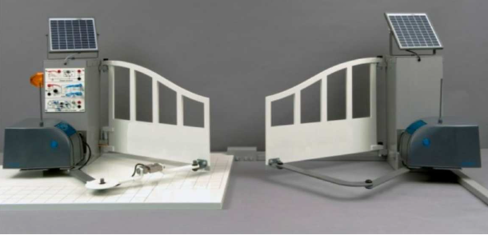
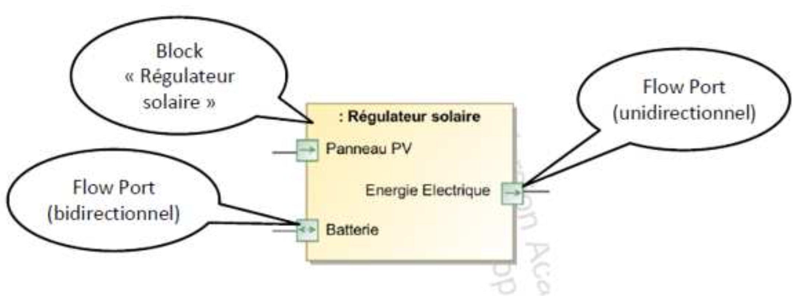

# SEQUENCE 4 : COMMENT CARACTERISER LES FLUX AU SEIN D'UN SYSTEME ?

## THEME D'ETUDE

Dans cette activité, vous allez **découvrir** les différents flux au sein d’un système du **laboratoire**.

## A VOTRE DISPOSITION

Vous avez, à votre disposition :

* Vos camarades ;
* Vos enseignants ;
* Votre ordinateur et les logiciels installés
* Vos écouteurs ;
* Une vidéo ;
* Le dossier technique du système
* Le système.

## SYSTEME ETUDIE : LE PORTAIL SET

### 1. Introduction et présentation du système

{:width=30%}

Dans le secteur de l’habitat, l’automatisation des dispositifs
d’accès est en fort développement.

Le système pédagogique proposé par la société SET s’appuis sur un produit innovant, développé par la société Avidsen, destiné à la commande de portails à battants. Ce produit se caractérise par une absence de liaison au réseau électrique basse tension grâce à son alimentation par panneaux  photovoltaïques ainsi que par une absence de liaison filaire entre les deux centrales électroniques grâce à la radio-transmission.

1.1. A partir de la description ci-dessus, expliquer en quoi ce produit participe au développement durable.       
1.2. Compléter les éléments manquants du diagramme des cas d’utilisation ci-dessous.     
1.3. A partir du diagramme des cas d’utilisation (SYSML), donner la fonction principale de ce produit.      
1.4. Indiquer alors l’élément principal qui apporte l’énergie nécessaire au déplacement du portail ?     

{:width=100%}

1.5. Sur l’illustration ci-dessous, compléter la légende avec les éléments suivants : panneau solaire, feu, antenne, réglage, batterie, moteur, bielle, équerre vantail, réducteur, capot, couvercle de protection. : trappe, bélier, porte, panneau photovoltaïque, bac.

 {:width=50%}

 1.6. Indiquer comment sont « simulés » les véhicules.

### 2. Analyse comportementale : Diagramme de blocs internes (IBD).

Le diagramme de bloc interne (Internal Bloc Diagram-IBD) est l’un des diagrammes du modèle SYSML permettant de représenter un système.

 {:width=50%}

Ce diagramme permet de représenter les flux (Flows) entre les constituants internes du système, appelés » Blocks ». Ces flux peuvent être de 3 natures :

* Matière(M)
* Energie(E)
* Information (I)

Les blocks disposent de ports de flux(Flow Port) : ils peuvent être de nature : 

* Unidirectionnel (In ou Out)
* Bidirectionnel, dans ce cas le flux peut rentrer ou sortir du block.

2.1. Sur le document réponse, Compléter le digramme IBD avec les éléments suivants : Position portail, énergie électrique ($\times$ 2), énergie mécanique de rotation ($\times$ 2), Batterie, énergie mécanique de translation, panneau photovoltaïque.    
2.2. A partir du diagramme IBD du portail SET ci-dessous, déterminer les éléments extérieurs au système, entourer les Flows ports correspondants.    
2.3. Tracer en Bleu le flux d’énergie principal, depuis la batterie jusqu’au portail.    
2.4. Tracer enbleupointillé le flux d’énergie de charge, depuis le soleil jusqu’à la batterie.    
2.5. Tracer en vert pointilléle flux d’information permettant au microcontrôleur de connaître l’état du système.    
2.6. Tracer en vertle flux d’information permettant la commande du moteur.    
2.7. Pour chaque block du diagramme IBD, donner le groupe auquel il appartient.    

Chaine d'énergie : **ALIMENTER, DISTRIBUER, CONVERTIR et TRANSMETTRE**      
Chaine d'information : **ACQUERIR, TRAITER, COMMUNIQUER**     

{:width=100%}

