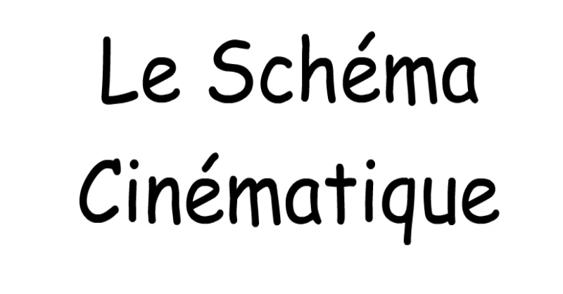

# LES LIAISONS CINÉMATIQUES

## PROBLÉMATIQUE ET OBJECTIFS

Pour représenter des mécanismes complexes nous avons besoin d’un langage qui décrive le système et le mobilités internes de celui-ci.    
Nous allons ainsi découvrir les différents types de liaisons entre solides et leurs représentations afin de pouvoir utiliser ces représentations pour décrire des systèmes réels

^^Objectifs :^^

* Définir les types de liaisons et les mouvements associés.
* Reconnaître sur un système réel le type de liaison.
* Représenter les liaisons.

## RESSOURCES

Voici le document réponse pour pouvoir répondre aux différentes questions :

* [DR_liaison_cinématique](./ressources/DR/liaisons_cinematiques_DR.pdf){:target= "_blank"}

## LES CONTACTS

Lancez la vidéo ci-dessous

[{width=70%}](./ressources/videos/cinematique_contacts.webm "Les contacts en cinématique"){:target="_blank"}

Question 1: **Complétez** le schéma de la question 1 du document réponse.

Question 2: **Faites** la série d’exercice de l'animation ([ici](https://perso.crans.org/geneau/NewCligne/ressources/contact_exo.html){:target="_blank"}) et noter votre score sur le document réponse.

## LES LIAISONS

Lancez la vidéo ci-dessous

[{width=70%}](./ressources/videos/cinematique_liaisons.webm "Les liaisons en cinématique"){:target="_blank"}

Question 3 : Que représentent T et R?

Question 4 : **Donnez** la signification du symbole suivant (nombre de mouvements, type de mouvement, degrés de liberté, nom de la liaison):

| T | R |
| -- | -- |
| 0 | 1 |
| 0 | 0 |
| 0 | 0 |

Question 5: **Complétez** le tableau suivant (il y aura ainsi toutes les liaisons possibles):

| T | R | Nom de la liaison |
| -- | -- | -- |
|  |  | Encastrement |
| 0 | 1 |  |
|  |  | Glissière |
|  |  | Pivot glissant |
| 1 | 1 |  |
|  |  | Rotule à doigt |
| 0 | 3 |  |
|  |  | Appuie plan |
|  |  | Linéaire annulaire |
|  |  | Linéaire rectiligne |
| 2 | 3 |  |

Question 6: **Faites** la série d’exercices des vidéos et **complétez** le document réponse (2 premières colonnes) au fur et à mesure (à partir de l'animation [ici](https://perso.crans.org/geneau/NewCligne/ressources/liaison_exo.html){:target="_blank"})

## LA REPRÉSENTATION DES LIAISONS

Lancez la vidéo ci-dessous

[{width=70%}](./ressources/videos/cinematique_representation.webm "La représentation des liaisons"){:target="_blank"}

Question 7 : **Reprenez** le tableau de la question 5 et complétez le avec les symboles.

Question 8 : **Faites** la série d’exercice à partir de l'animation ([ici](https://perso.crans.org/geneau/NewCligne/ressources/2_she_cine_base_exo.html){:target="_blank"})

Si vous avez du temps vous pouvez aussi faire les exercices de révisions disponibles [ici](https://perso.crans.org/geneau/NewCligne/ressources/2b_she_cine_base_exo2.html){:target="_blank"}

