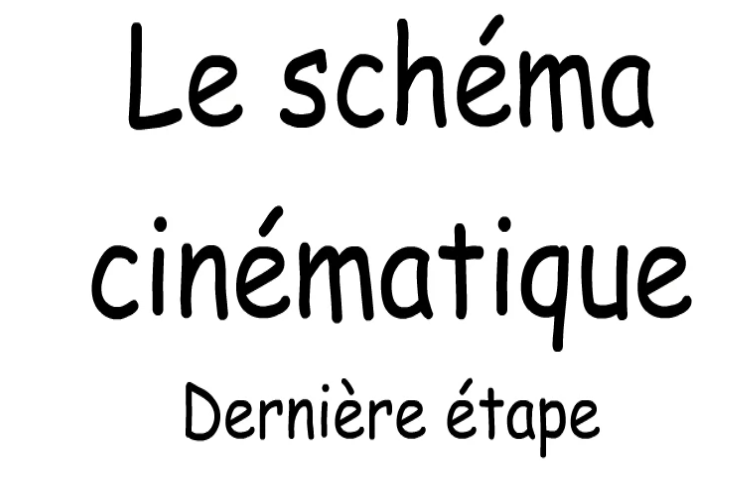

# LES SCHÉMAS CINÉMATIQUES

## PROBLÉMATIQUE ET OBJECTIFS

Pour représenter des mécanismes complexes nous avons besoin d’un langage qui décrive le système et le mobilités internes de celui-ci.

^^Objectifs :^^

* Se réapproprier une méthodologie (sur la cinématique)
* Utiliser la représentation à partir d'un plan.
* Représenter un système réel.

## RESSOURCES

Voici le document réponse pour pouvoir répondre aux différentes questions :

* [DR_schémas-cinématiques](./ressources/DR/schema_cinematique_DR.pdf){:target= "_blank"}

## MÉTHODOLOGIE ET RAPPELS

Regarder la vidéo et repondre aux questions

[{width=70%}](./ressources/videos/cinematique_classe-equivalence.webm "Classe d'équivalence"){:target="_blank"}

Question 1: **Définissez** ce qu'est une classe d'équivalence.
Question 2: **Notez** les deux règles à respecter.

Application à la bride hydraulique. Regardez la vidéo pour comprendre le rôle et le fonctionnement de la bride hydraulique.

[{width=70%}](./ressources/videos/bride-hydraulique.webm "La Bride Hydraulique"){:target="_blank"}

Question 3: **Regrouper** en coloriant les différentes classe d'équivalence de la pièce (bride hydraulique) ci-dessous.

{width=100%}

Regardez la vidéo ci-dessous et répondez aux questions.

[{width=70%}](./ressources/videos/schema-cinematique.webm "Le schéma cinématique"){:target="_blank"}

Question 4 : **Notez** les 4 étapes de la méthode pour réaliser un schéma cinématique
Question 5 : **Retrouvez** (ou relevez) le schéma cinématique de la bride hydraulique

## ENTRAINEMENT : LE COUPE TUBE

Nous allons maintenant étudier le coupe tube

Voici une petite vidéo pour comprendre comment on utilise le "coupe tube" 

[{width=70%}](./ressources/videos/schema-cinematique.webm "Le schéma cinématique"){:target="_blank"}

Question 6 : On va d'abord travailler classe d'équivalent par classe d'équivalent (une par une) en répondant au QCM ci-dessous:

{width=70%}

Question 7 : **Compléter** maintenant avec différentes couleurs toutes les classes d'équivalence du coupe tube:

{width=100%}

## APPLICATION À PARTIE D'UN PLAN : LA POMPE HYDRAULIQUE MANUELLE

Le mécanisme présenté est une pompe hydraulique manuelle. Elle peut mettre en pression un circuit hydraulique qui contient de l’huile ou du fuel et permettre ainsi de tester la résistance à la pression du circuit, d’un clapet, d’un gicleur ou d’un injecteur. Cette pompe se manœuvre à la main à l’aide du levier 1. Elle est reliée au circuit hydraulique par les raccords 8.

Comment ça marche? Regarder la vidéo 

[{width=70%}](./ressources/videos/pompe-hydraulique-manuelle.mp4 "La pompe hydraulique manuelle"){:target="_blank"}

Rappel de la méthode à suivre :
* Etape 1: Colorier chaque sous ensemble d'une couleur différente puis définissez les groupes fonctionnels.
* Etape 2: Graphe de liaisons et Indiquer le nom de la liaison
* Etape 3: Dessiner le schéma cinématique (2D correspondant à la coupe A-A sur le plan) du mécanisme.

| Rep. | Nbre | Désignation |
| :-: | :-: | -- |
| 1 | 1 | Corps |
| 2 | 1 | Chemise |
| 3 | 1 | Piston |
| 4 | 1 | Levier |
| 5 | 1 | Axe |
| 6 | 1 | Joint torique |
| 7 | 1 | Ressort |
| 8 | 2 | Bille |
| 9 | 2 | Coupelle ressort |
| 10 | 2 | Ressort |
| 11 | 2 | Raccord fileté |

Question 8 : **Compléter** les classes d'équivalence de la pompe sur les 3 schémas (en coupe) :

{width=100%}

Question 9 : **Faire** le graphe des liaisons

Question 10 : **Faire** le schéma cinématique de la pompe

## EN BONUS : UN SYSTÈME RÉEL (ÉVALUÉ)

Nous disposons du bras robot ci-dessous:

{width=40%}

{width=100%}

Vous avez à disposition des trames isométrique pour une éventuelle réalisation en 3D.

_^^Conseil :^^ **Tâtonnez** au brouillon avant la mise au propre_

Question 11 : **Faire** le schéma cinématique 3D du bras robot.

{width=100%}