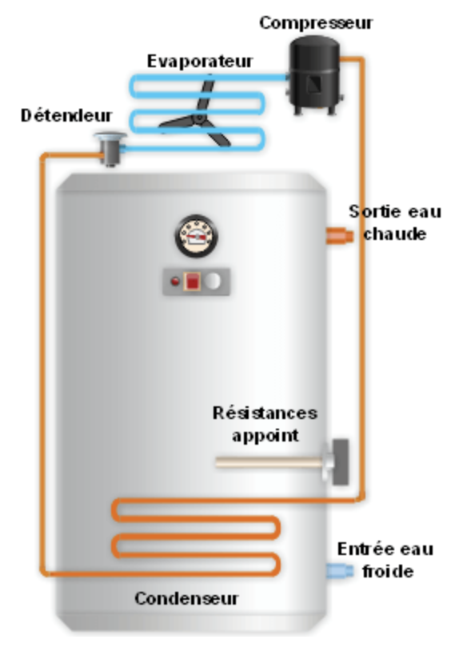

# B.E.C. thermodynamique

## Le Ballon d'eau chaude (B.E.C.) thermodynamique  : comment ça marche ?

{:width=30%}

Ce dispositif allie un ballon de stockage d’eau chaude et une pompe à chaleur électrique (PAC).

Il s’agit donc d’un cumulus avec une pompe à chaleur qui fonctionne grâce à des fluides frigorigènes. Il prend les calories de l’air pour chauffer l’eau et rejette un air froid. Une résistance électrique d’appoint prend le relais s’il fait très froid dehors ou en cas de besoin trop important.

 

La pompe à chaleur intégrée au chauffe-eau thermodynamique dispose d'un ventilateur qui aspire l'air environnant (PAC air/air), afin de réchauffer un fluide frigorigène circulant dans un circuit fermé. L'air est ensuite rejeté dans le local ou hors de l'habitation, une fois que les calories qu’il contient ont été extraites. En s'échauffant, le fluide frigorigène passe d'un état liquide à un état gazeux, et ce gaz va pouvoir être comprimé au sein d'un compresseur, dans le but d'accroître sa pression et sa température. La chaleur du fluide est alors transférée vers le ballon de stockage d’eau via un échangeur thermique, ce qui permet de chauffer l'eau sanitaire de votre habitation. Enfin, en refroidissant, le fluide retrouve sa forme liquide et un nouveau cycle de chauffe peut commencer.

 
L’énergie consommée par la PAC provient en partie de l’électricité consommée par le compresseur et en partie des calories prises sur l’air extérieur. Seule l’électricité étant payante, le coût de production de chaleur est réduit.

 
### Le cycle de fonctionnement est le suivant:

1. Le ventilateur aspire l’air
2. L’air aspiré réchauffe le fluide frigorigène en lui transmettant ses calories. Le fluide passe alors de l’état liquide à l’état gazeux dans l’évaporateur.
3. Le compresseur augmente la température et la pression du fluide frigorigène.
4. Le fluide frigorigène passe de l'état vapeur à l'état liquide dans le condenseur. Il cède alors de la chaleur à l'eau du ballon via l’échangeur.
5. Le fluide frigorigène est détendu afin de s’évaporer et le cycle recommence.
6. Si l’apport de chaleur n’est pas suffisant, la résistance électrique assure l’appoint.
 

## Configuration et emplacement

### Prise d'air ambiant

Le ballon thermodynamique est situé dans une pièce non chauffée mais isolée, type garage ou buanderie, d'un volume supérieur à 20 m³ et capte l'air ambiant directement. Cela permet de ne pas avoir de bruit à l'intérieur. Cependant, le risque est de refroidir de manière trop importante le local où il est situé avec un cercle vicieux : la PAC refroidit l'air, qui lui apporte alors moins d'énergie et la PAC voit ses performances diminuer. De plus, le local n'étant pas chauffé, les pertes par refroidissement du ballon sont importantes. C'est une configuration déconseillée, d'autant que la température peut descendre largement en dessous de zéro et donc faire des dégâts dûs au gel (canalisation d'eau, matériel, etc.).

 

### Prise d'air extérieur

#### Monobloc

Le ballon thermodynamique est situé dans le volume chauffé. L'air est capté de l'extérieur via des gaines. Les pertes par refroidissement sont diminuées, mais les performances sont légèrement moins bonnes qu'avec la prise d'air dans un local isolé. Il y a un risque de gêne auditive. C'est la configuration d'installation recommandée et que l'on trouve le plus dans le neuf. A noter : les CET ne sont pas forcément étanches et peuvent donc pénaliser le test d'étanchéité de la RT 2012.

 

#### Split système

Le ballon thermodynamique est séparé en deux modules. La pompe à chaleur est située à l'extérieur et y capte l'énergie contenue dans l'air. Le ballon, situé en volume chauffé, ne sert que de stockage (cumulus). Il peut y avoir une gêne auditive du voisinage et les performances sont dégradées, car les risques que la pompe à chaleur givre sont importants, ce qui impose des cycles de dégivrages via des résistances électriques. Les problèmes de fiabilité sont également plus présents, car la pompe à chaleur est soumise aux intempéries.

 

 

## Association avec une VMC (Ventilation mécanique contrôlée)

### Prise d'air extrait

#### VMC Simple Flux

Le ballon thermodynamique est situé dans le volume chauffé. Il capte l'énergie de l'air extrait par la VMC Simple Flux. Il y a un risque de gêne auditive, mais les performances sont largement accrues. Le prix de ce système est sensiblement supérieur aux autres et il faut un debit d'air suffisant pour qu'il puisse fonctionner correctement.

#### VMC Double Flux

Très semblable à la VMC Thermodynamique dont il est une évolution, le ballon thermodynamique couplé à une VMC Double Flux récupère la chaleur de l'air extrait et produit à la fois du chauffage et de l'eau chaude sanitaire. C'est le tout-en-un de la maison. Cependant, peu de modèles sont disponibles et il y a donc relativement peu de retours sur les performances réelles. Ces dernières ne sont pas forcément plus élevées que celles sur simple flux, puisque le fait de travailler sur 2 régimes de température différents entraîne une diminution du rendement.
Tout est possible

En réalité, tout comme une pompe à chaleur, on peut puiser la chaleur partout où elle est présente, donc dans l'air comme évoqué dans les configurations précédentes, mais également dans le sol ou dans l'eau, avec des solutions géothermiques. Toutefois, les CET géothermiques sont très rares et peu intéressants (pour un particulier). Dans la majorité des cas, ce sera une pompe à chaleur géothermique qui assurera le chauffage et éventuellement l'eau chaude sanitaire en complément.