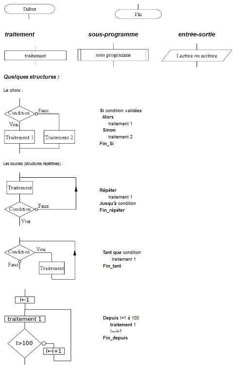

# Partie N°1 : rappels sur les algorithmes et algorigrammes

## 1. Algorithmes

Nous allons travailler sur des programmes informatiques simples sous forme d'algorithmes graphiques  appelés algorigrammes ('flowchart' en anglais).
Ils comportent un début et une fin, des liaisons orientés, des blocs “symbole” : traitement (affectations de variables, calculs..), gestions des entrées et des sorties, sous-programmes (fonctions).

